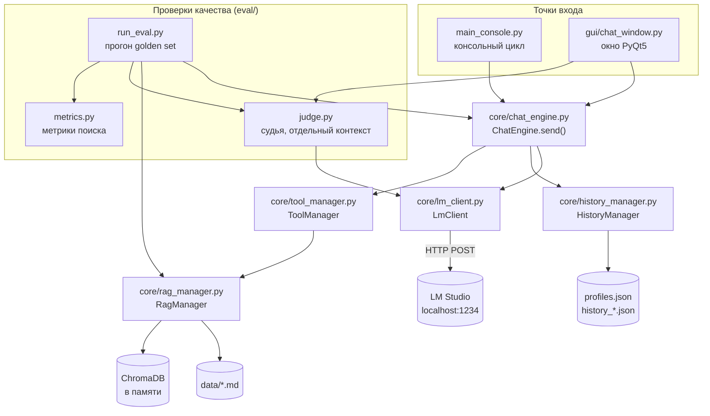
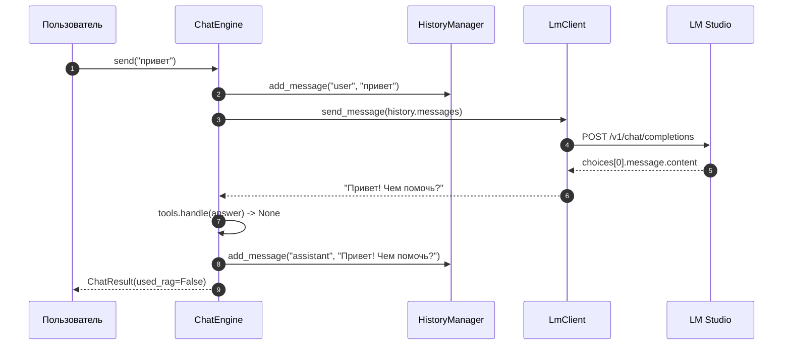
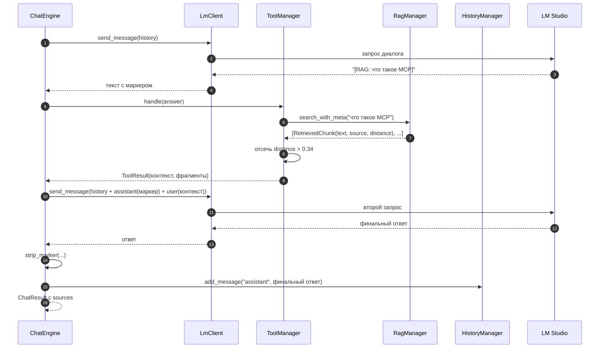
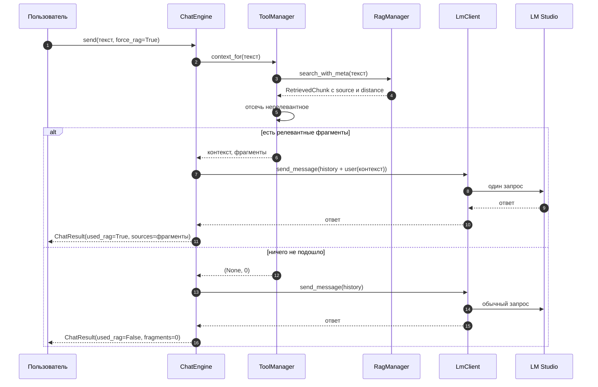
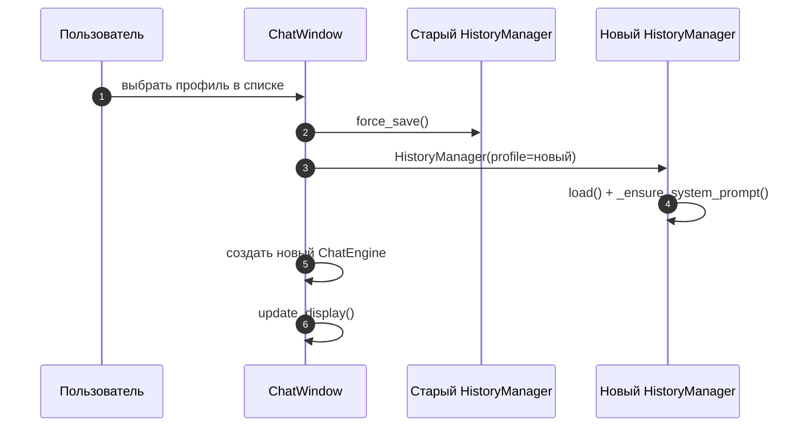
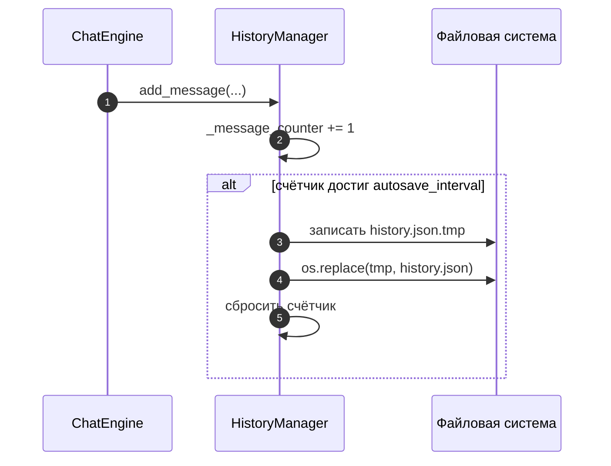
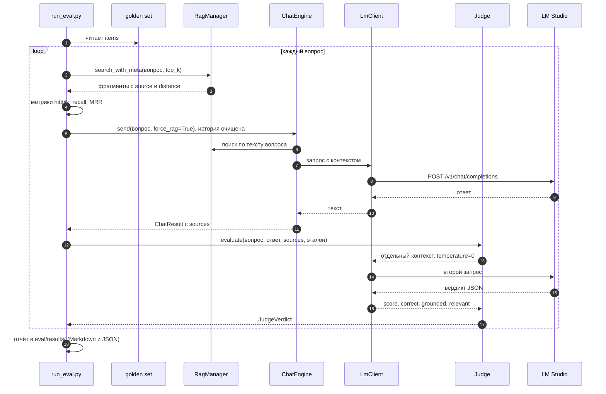

# Sivi: разбор учебного проекта

Этот текст подробно объясняет, как устроен Sivi. Что делает каждый файл, из каких
частей он состоит и как эти части работают вместе. Он рассчитан на человека,
который немного знает Python и хочет разобраться, как сделать чат с языковой
моделью, историю диалога, поиск по своим заметкам (RAG) и проверку качества
ответов.

`README.md` это короткое описание: что это и как запустить. А здесь речь о том,
как всё работает внутри и как это написано кодом.

Сам код при этом оставлен чистым. Почти все пояснения вынесены сюда, чтобы файлы
можно было спокойно запускать и разбирать построчно.

## Как читать

Можно идти двумя путями.

1. Сверху вниз. Сначала разделы 1-4 для общей картины, потом 5 с запуском, дальше
   разбор модулей (6) и сценарии (7).
2. Сразу по код. Раздел 6 самый важный: там для каждого модуля приведены реальные
   куски кода с пояснениями. Раздел 11 это маленький справочник по конструкциям
   Python, которые встречаются в проекте.

Фрагменты в разделе 6 даны почти как в исходниках. Где-то убраны внешние отступы
класса и лишние строки, пропуски помечены `...`. Под каждым фрагментом я
объясняю, зачем он нужен, какую проблему решает и какой синтаксис в нём
используется. Удобно открыть файлы проекта рядом и сверяться.

Раздел 6.9 рассказывает про `eval/`: golden set, метрики поиска и судью. Раздел 9
это шпаргалка по настройкам, раздел 10 про то, что в проекте осознанно не сделано.

---

## 1. Что такое Sivi в двух словах

Sivi это учебный чат-ассистент на Python. Он умеет:

- общаться с языковой моделью, которая запущена локально в LM Studio;
- хранить историю диалога в JSON, поэтому она не пропадает после перезапуска;
- держать несколько профилей с разными системными промптами и своей историей у
  каждого;
- искать ответ в личных `.md`-заметках (это и есть RAG) двумя способами;
- работать и в консоли, и в окне на PyQt5, причём логика у них общая;
- проверять качество ответов: офлайн-метрики поиска по golden set и оценка судьёй
  (та же модель, но в отдельном контексте).

Главная идея архитектуры такая: вся логика диалога живёт в `core/`, а консоль и
окно это только пульты управления. Поэтому поведение в обоих режимах одинаковое
и его не приходится писать дважды. Проверки качества вынесены в отдельную папку
`eval/`: они пользуются теми же сервисами `core/`, но в обычном чате не участвуют.

---

## 2. Словарь терминов

| Термин | Что это значит в проекте |
| --- | --- |
| **LLM** | Языковая модель, которая генерирует ответ. Здесь это модель в LM Studio. |
| **LM Studio** | Локальный сервер, который поднимает модель и отдаёт её по HTTP. |
| **OpenAI-совместимый API** | Формат запроса и ответа как у OpenAI. Sivi использует только его, поэтому сервер легко заменить. |
| **Системный промпт** | Первое сообщение с ролью `system`, которое задаёт характер и правила ассистента. |
| **Профиль** | Набор из системного промпта и своей истории, описан в `profiles.json`. |
| **RAG** | Retrieval-Augmented Generation. Сначала ищем нужные куски своих заметок, потом отдаём их модели как контекст. |
| **Эмбеддинг** | Числовой вектор, который описывает смысл текста. Похожие тексты дают близкие векторы. |
| **Чанк (фрагмент)** | Кусок заметки. Текст режется на такие куски перед поиском. |
| **Distance** | Насколько найденный фрагмент не похож на запрос. Чем меньше, тем ближе по смыслу. |
| **ChromaDB** | Векторная база: хранит эмбеддинги и умеет искать ближайшие. Здесь живёт в памяти. |
| **reasoning-модель** | Модель, которая сначала думает (`reasoning_content`), а потом отвечает. Тратит много токенов. |
| **Маркер `[RAG: ...]`** | Текстовый сигнал от модели: «мне нужен контекст». Sivi его распознаёт. |
| **Golden set** | Фиксированный набор вопросов с эталонами и ожидаемыми источниками. По нему прогоняют проверки качества. |
| **Retrieval-метрика** | Число о качестве поиска (нашёлся ли нужный файл, на каком месте). Считается без модели. |
| **LLM-as-judge** | Приём, когда качество ответа оценивает другая (или та же, но отдельная) модель по рубрике. |
| **Groundedness** | Опора ответа на найденный контекст. Если факты не подтверждаются фрагментами, ответ «не обоснован». |

---

## 3. Карта проекта

```text
Sivi/
├── core/                     вся логика приложения
│   ├── lm_client.py          клиент к LM Studio: запрос, разбор ответа и ошибок
│   ├── history_manager.py    история диалога, автосохранение, профили
│   ├── rag_manager.py        чтение data/*.md, эмбеддинги, поиск по ChromaDB
│   ├── tool_manager.py       распознавание маркера [RAG: ...] и сборка контекста
│   └── chat_engine.py        один ход диалога, общий для консоли и окна
├── eval/                     проверка качества ответов и поиска
│   ├── golden_set.json       вопросы, эталоны и ожидаемые источники
│   ├── metrics.py            метрики поиска, чистые функции без модели
│   ├── judge.py              судья: отдельный контекст и разбор вердикта
│   ├── run_eval.py           прогон golden set, отчёты в eval/results/
│   ├── make_drafts.py        генератор черновиков вопросов по заметкам
│   └── results/              отчёты прогонов (в git не хранятся)
├── gui/
│   └── chat_window.py        окно на PyQt5
├── main_console.py           чат в консоли
├── test.py                   офлайн-проверки логики (+ опционально живой запрос)
├── data/                     заметки .md для RAG (демо-набор лежит в git)
├── profiles.json             системные промпты профилей
├── history.json              история профиля default (в git не хранится)
├── requirements.txt          зависимости
└── README.md                 краткое описание и запуск
```

Файлы по слоям:

| Слой | Файлы | За что отвечает |
| --- | --- | --- |
| Точки входа | `main_console.py`, `gui/chat_window.py` | Принимают ввод, показывают ответ, обрабатывают команды и кнопки. |
| Оркестрация | `core/chat_engine.py` | Решает, в каком порядке звать остальных. |
| Сервисы | `core/lm_client.py`, `core/history_manager.py`, `core/rag_manager.py`, `core/tool_manager.py` | Каждый умеет одну вещь и не управляет диалогом. |
| Проверки | `test.py`, `eval/` | `test.py` гоняет логику на заглушках, `eval/` измеряет качество поиска и ответов по golden set. |

---

## 4. Общая схема



Если словами: и консоль, и окно передают сообщение пользователя в `ChatEngine`.
Движок сам решает, сходить ли сначала за контекстом в `ToolManager`, а потом
всегда отправляет диалог в `LmClient`, который по HTTP общается с LM Studio.
История складывается в `HistoryManager` и уезжает в JSON-файлы. `ToolManager` при
необходимости дёргает `RagManager`, а тот читает заметки и ищет по векторам.

Отдельная ветка `eval/` не участвует в обычном диалоге. `run_eval.py` берёт вопросы
из golden set, гоняет их через тот же `ChatEngine` и `RagManager`, считает метрики
поиска и зовёт `Judge`. Судья ходит в тот же `LmClient`, но со своим контекстом.
А `gui/chat_window.py` по кнопке «Оценить» может позвать судью для последнего ответа.

> Диаграммы написаны на Mermaid. Их понимают GitHub, GitLab и VS Code с
> расширением Markdown Preview Mermaid. В обычном просмотрщике будет виден
> исходный текст блока, и это нормально.

---

## 5. Быстрый старт

Окружение:

```bash
python -m venv venv
venv/Scripts/activate            # Windows
# source venv/bin/activate       # Linux/macOS
pip install -r requirements.txt
```

`requirements.txt` разделён на две части: обязательные пакеты (`requests`, `PyQt5`)
и опциональные для RAG (`chromadb`, `sentence-transformers`). Без второй части
Sivi всё равно запустится, просто как обычный чат без поиска по заметкам.

Дальше нужно запустить LM Studio, загрузить модель и держать её на порту `1234`.
Если порт другой, адрес меняется константой в `core/lm_client.py`.

Запуск:

```bash
python main_console.py      # консоль
python gui/chat_window.py   # окно
```

Для поиска положи свои `.md`-файлы в `data/`. В репозитории лежит демо-набор
заметок про LLM, и он же служит основой для проверок в `eval/`. Личные заметки
по умолчанию в git не попадают: папка `data/` игнорируется, а демо-файлы
разрешены явными строками в `.gitignore`.

Проверки логики:

```bash
python test.py            # офлайн, модель не нужна
python test.py --live     # плюс один реальный запрос к LM Studio
```

Проверки качества (нужен RAG и запущенная модель):

```bash
python eval/run_eval.py --model qwen/qwen3.5-9b
python eval/run_eval.py --no-judge      # только метрики поиска
python eval/make_drafts.py              # черновики вопросов по заметкам
```

Если в LM Studio загружено несколько моделей, `--model` обязателен: без него
сервер вернёт ошибку 400. С одной загруженной моделью можно не указывать.

---

## 6. Разбор модулей

Сначала для каждого модуля идёт короткое «за что отвечает» и таблица сущностей,
затем самые важные куски кода с пояснениями. Пропуски в коде помечены `...`. Под
фрагментом я разбираю, зачем он здесь, какую проблему решает и какой синтаксис
Python в нём используется.

### 6.1 `core/lm_client.py`: связь с моделью

Единственное место, которое знает про HTTP и формат OpenAI-совместимого API. Всё
остальное в проекте про сеть не думает.

| Сущность | Смысл |
| --- | --- |
| `DEFAULT_BASE_URL` | `http://localhost:1234/v1/chat/completions` |
| `DEFAULT_MAX_TOKENS` | `8192`, запас для reasoning-моделей |
| `DEFAULT_TIMEOUT` | `300` секунд |
| `LmClientError` | Своя ошибка: сеть, HTTP, плохой или пустой ответ |
| `LmClient` | Класс с настройками (`base_url`, `model`, `temperature`, `max_tokens`, `timeout`) |
| `LmClient.send_message(messages, ...)` | Принимает историю, возвращает строку-ответ |

#### Код 1. Константы и своя ошибка

```python
DEFAULT_BASE_URL = "http://localhost:1234/v1/chat/completions"
DEFAULT_MAX_TOKENS = 8192
DEFAULT_TIMEOUT = 300


class LmClientError(Exception):
    """Ошибка обращения к LLM: сеть, HTTP, некорректный или пустой ответ."""
```

Адрес и лимиты вынесены в константы наверху модуля. Так их видно сразу, и менять
их нужно в одном месте. Имена капсом это соглашение Python (PEP 8): значит, что
значение не меняется по ходу программы.

Почему своя ошибка, а не готовая. `class LmClientError(Exception)` наследуется от
встроенного `Exception`. Свой тип нужен, чтобы вызывающий код мог поймать именно
проблемы связи, а не вообще всё подряд:

```python
except LmClientError as e:      # понятная ошибка модели или сети
    ...
```

Если бы модуль бросал, скажем, `ValueError`, то этот же `except` случайно ловил
бы и ошибки логики внутри Sivi. Свой класс разделяет такие ситуации. Строка в
тройных кавычках под классом называется docstring, это короткое описание.

#### Код 2. Конструктор: настройки как параметры

```python
class LmClient:
    def __init__(self, base_url=DEFAULT_BASE_URL, model=None,
                 temperature=0.65, max_tokens=DEFAULT_MAX_TOKENS, timeout=DEFAULT_TIMEOUT):
        self.url = base_url
        self.model = model
        self.temperature = temperature
        self.max_tokens = max_tokens
        self.timeout = timeout
```

`__init__` это конструктор, он вызывается при `LmClient()`. Значения по умолчанию
берутся из констант модуля. Запись `self.` означает «сохранить в объект», и потом
эти поля доступны в методах через `self.url` и так далее.

`model=None` означает «модель не задана». Позже код проверит это и просто не
положит поле `model` в запрос, чтобы LM Studio взяла активную модель сама.
Параметры со значениями по умолчанию позволяют написать `LmClient(timeout=60)` и
переопределить только таймаут, не трогая остальное.

#### Код 3. Сборка payload и ловушка с None

```python
def send_message(self, messages: list, temperature=None, max_tokens=None, model=None) -> str:
    payload = {
        "messages": messages,
        "temperature": self.temperature if temperature is None else temperature,
        "max_tokens": self.max_tokens if max_tokens is None else max_tokens,
    }
    chosen_model = model if model is not None else self.model
    if chosen_model:
        payload["model"] = chosen_model
```

`payload` это тело HTTP-запроса. Условие `if temperature is None` читается так:
если параметр не передали, берём настройку объекта, а если передали, берём его.
Это приём «значение по умолчанию можно переопределить на один вызов».

А вот почему нельзя написать `temperature or self.temperature`. Значение `0.0` это
валидная температура (полностью детерминированный ответ), но в Python `0.0`
считается ложным, и `or` подменил бы его на настройку объекта. Сравнение с `None`
такой ошибки не допускает: `0.0 is None` это ложь, значит `0.0` останется.
Конструкция `A if условие else B` называется тернарным оператором.

Проверка `if chosen_model:` означает «строка не пустая и не `None`». Если модель
не задана, ключ `model` в payload просто не добавляется. Наконец, `-> str` это
аннотация типа: функция возвращает строку. Python её не проверяет во время работы,
но она документирует код и помогает редактору.

#### Код 4. Запрос и перенос ошибки

```python
try:
    response = requests.post(self.url, json=payload, timeout=self.timeout)
    response.raise_for_status()
except requests.exceptions.RequestException as e:
    raise LmClientError(f"Ошибка связи с LM Studio ({self.url}): {e}") from e
```

Здесь собраны три важные вещи: отправка запроса, проверка статуса и перевод
библиотечной ошибки в свою.

`requests.post(self.url, json=payload, ...)` использует библиотеку `requests`,
которая сама превращает словарь `payload` в JSON и ставит нужный заголовок
`Content-Type`. Параметр `timeout=self.timeout` задаёт предел ожидания: без него
запрос мог бы висеть вечно, если сервер не отвечает. Вызов
`response.raise_for_status()` бросает исключение, если сервер вернул код 4xx или
5xx. Без этой строки ошибка сервера прошла бы молча и упала бы дальше на разборе
JSON.

`requests.exceptions.RequestException` это базовый класс сетевых ошибок requests
(нет связи, таймаут, плохой статус). Ловим базовый, чтобы одним `except` покрыть
все сетевые проблемы.

Теперь про `raise ... from e`. Конструкция `from e` называется цепочкой
исключений: наружу уходит наша понятная `LmClientError`, но внутри сохраняется
исходная причина. В трейсбеке будет видно и то, и другое, поэтому при отладке не
потеряются детали сетевой ошибки. Без `from` Python тоже связывает исключения, но
менее явно.

#### Код 5. Разбор ответа и понятные ошибки

```python
try:
    data = response.json()
except ValueError as e:
    raise LmClientError(f"Сервер вернул не JSON: {e}") from e

choices = data.get("choices") or []
if not choices:
    raise LmClientError(f"В ответе нет choices: {str(data)[:300]}")

choice = choices[0]
message = choice.get("message") or {}
content = (message.get("content") or "").strip()

if content:
    return content

reasoning = message.get("reasoning_content") or ""
if choice.get("finish_reason") == "length":
    raise LmClientError(
        "Модель израсходовала лимит max_tokens на reasoning и не успела ответить. "
        f"Увеличьте max_tokens (сейчас {payload['max_tokens']})."
    )
if reasoning:
    raise LmClientError("Модель вернула только reasoning_content без ответа. Попробуйте ещё раз.")
raise LmClientError("Модель вернула пустой ответ.")
```

Разбираем ответ сервера и добиваемся, чтобы любая нестандартная ситуация
превращалась в понятное сообщение, а не в падение с непонятным `KeyError`.

Вызов `response.json()` может упасть, если сервер вернул не JSON (например,
HTML-страницу ошибки). Исключение `json.JSONDecodeError` является подклассом
`ValueError`, поэтому достаточно ловить `ValueError`.

Запись `.get("choices") or []` это идиома «взять значение или пустой список».
Если ключа нет, `.get` вернёт `None`, а `or []` заменит его на пустой список.
Дальше проверка `if not choices` (пустой список это ложь) сработает безопасно.
Срез `str(data)[:300]` обрезает ответ до 300 символов для сообщения об ошибке:
ответ модели может быть огромным, и печатать его целиком в консоль не нужно.
Строка `(message.get("content") or "").strip()` защищает от `null` в JSON и убирает
пробелы по краям. Скобки тут важны: сначала `.get`, потом `or ""`, и только потом
`.strip()`. А `if content: return content` это счастливый путь: нормальный ответ
выходим сразу.

Проверок на пустоту так много потому, что у reasoning-моделей ответ часто пустой:
она потратила весь лимит токенов на размышления. Значение
`finish_reason == "length"` означает «остановились по лимиту». Разделяя причины,
Sivi подсказывает, что делать: увеличить `max_tokens` или просто повторить
запрос. Без этого пользователь видел бы «модель вернула пустой ответ» и не
понимал причину.

С этим модулем связан `ChatEngine`, который его использует. А ошибку ловят точки
входа (`main_console.py` и GUI), чтобы показать человеку понятный текст.

---

### 6.2 `core/history_manager.py`: память и профили

Хранит список сообщений диалога, знает системный промпт профиля и сохраняет всё
в JSON. Никакой сети и GUI здесь нет.

| Сущность | Смысл |
| --- | --- |
| `PROJECT_ROOT`, `PROFILES_PATH` | Пути к корню проекта и `profiles.json` |
| `FALLBACK_SYSTEM_PROMPT` | Промпт на случай, если профиль не прочитался |
| `history_path_for_profile(profile)` | `default` даёт `history.json`, остальные `history_<profile>.json` |
| `load_profiles()` | Читает `profiles.json`, при ошибке отдаёт профиль по умолчанию |
| `HistoryManager` | Работа с историей одного профиля |
| `HistoryManager.messages` | Список словарей вида `{"role": ..., "content": ...}` |

#### Код 1. Пути, которые не зависят от запуска

```python
import json
import os

PROJECT_ROOT = os.path.dirname(os.path.dirname(os.path.abspath(__file__)))
PROFILES_PATH = os.path.join(PROJECT_ROOT, "profiles.json")


def history_path_for_profile(profile: str) -> str:
    if profile == "default":
        return os.path.join(PROJECT_ROOT, "history.json")
    return os.path.join(PROJECT_ROOT, f"history_{profile}.json")
```

Файлы `profiles.json` и `history.json` лежат в корне проекта, а
`history_manager.py` в подпапке `core/`. Значит, нужно вычислить путь к корню,
откуда бы программу ни запустили.

Разберём `os.path.dirname(os.path.dirname(os.path.abspath(__file__)))`. Сначала
`__file__` даёт путь к текущему файлу, то есть к этому модулю. Потом
`os.path.abspath(...)` делает путь абсолютным, чтобы он не зависел от рабочей
папки. Первый `os.path.dirname(...)` убирает имя файла и оставляет `.../core`,
второй убирает `core` и оставляет корень проекта.

Если бы в коде стояло просто `open("profiles.json")`, программа искала бы файл в
текущей рабочей папке, а она разная при запуске из корня и, скажем, из `gui/`.
Абсолютный путь решает это навсегда. Ещё здесь важен `os.path.join` вместо
склейки строк через `+`: он сам подставляет правильный разделитель (`\` на
Windows, `/` на Linux), поэтому ручная склейка не нужна. А `f"history_{profile}.json"`
это f-строка, она подставляет значение переменной внутрь строки.

#### Код 2. Чтение профилей, которое не падает

```python
FALLBACK_SYSTEM_PROMPT = "Ты — Sivi, универсальный ассистент. Отвечай на русском, кратко и по делу."


def load_profiles() -> dict:
    try:
        with open(PROFILES_PATH, "r", encoding="utf-8") as f:
            profiles = json.load(f)
        if isinstance(profiles, dict) and profiles:
            return profiles
    except (OSError, json.JSONDecodeError) as e:
        print(f"[Профили] Не удалось прочитать {PROFILES_PATH}: {e}")
    return {"default": {"name": "Sivi", "system_prompt": FALLBACK_SYSTEM_PROMPT}}
```

`profiles.json` это обычный файл, который пользователь может испортить или
удалить. Функция должна вернуть корректный словарь профилей в любом случае.

Конструкция `with open(...) as f` гарантированно закроет файл, даже если внутри
блока произойдёт ошибка. Без `with` пришлось бы вызывать `f.close()` вручную и не
забыть про исключения. Аргумент `encoding="utf-8"` обязателен для русского
текста: без него на Windows Python может выбрать кодировку cp1251 и выдать ошибку
или кракозябры.

В `except (OSError, json.JSONDecodeError)` мы ловим сразу два типа: проблемы
файловой системы (нет файла, нет прав) и некорректный JSON. А проверка
`isinstance(profiles, dict) and profiles` убеждается, что в файле словарь и он не
пустой: даже валидный JSON может быть списком или `{}`. Если что-то не так,
выполнение доходит до последней строки и возвращает профиль по умолчанию.
Принцип простой: падать мягко, чтобы приложение продолжало работать.

#### Код 3. Системный промпт всегда первым

```python
def _ensure_system_prompt(self):
    """Промпт профиля всегда стоит первым сообщением."""
    if self.messages and self.messages[0].get("role") == "system":
        self.messages[0]["content"] = self.system_prompt
    else:
        self.messages.insert(0, {"role": "system", "content": self.system_prompt})
```

API ожидает, что системный промпт стоит в начале диалога. Плюс, если профиль
сменился, промпт в истории надо заменить. Метод делает и то, и другое, причём его
можно вызывать сколько угодно раз без вреда.

Условие `self.messages and ...` использует короткое замыкание: если список пустой,
правая часть не вычисляется, и мы не получаем `IndexError` на `self.messages[0]`.
Вызов `.get("role")` безопасно читает ключ: если его нет, вернётся `None`, а не
исключение. Если первое сообщение уже системное, просто обновляем текст. Иначе
`insert(0, ...)` вставляет новое сообщение в начало, меняя список на месте.

#### Код 4. Загрузка, которая терпит мусор

```python
def load(self):
    if not os.path.exists(self.filepath):
        self.messages = []
        return
    try:
        with open(self.filepath, "r", encoding="utf-8") as f:
            data = json.load(f)
    except (OSError, json.JSONDecodeError):
        self.messages = []
        return

    if isinstance(data, list):
        self.messages = [m for m in data
                         if isinstance(m, dict) and "role" in m and "content" in m]
    else:
        self.messages = []
```

История это файл на диске, который может отсутствовать, быть битым или содержать
чужие данные. `load` не имеет права уронить запуск.

Сначала идёт ранний выход `return`, если файла нет. Это типичный приём: сначала
обработать простой случай и не громоздить вложенность. Дальше списочное включение
(list comprehension) `[m for m in data if ...]` коротко записывает цикл «взять
каждый `m`, если он словарь и содержит `role` и `content`». Обычным циклом это
было бы пять строк с `append`. Проверка `isinstance(m, dict)` защищает от
элементов, которые не словари (например, строки в списке). Тесты как раз
проверяют такой мусор.

#### Код 5. Атомарное сохранение

```python
def save(self):
    # Атомарная запись, чтобы не оставить битый файл.
    tmp_path = self.filepath + ".tmp"
    with open(tmp_path, "w", encoding="utf-8") as f:
        json.dump(self.messages, f, ensure_ascii=False, indent=2)
    os.replace(tmp_path, self.filepath)
```

Это самая важная защита данных в проекте. Сначала данные пишутся во временный
файл `<имя>.tmp`, потом `os.replace(tmp_path, self.filepath)` заменяет старый файл
новым одной операцией. На одной файловой системе такая замена атомарна: снаружи
файл существует либо в старом виде, либо в новом, половинчатого состояния не
бывает.

В `json.dump` два важных аргумента. `ensure_ascii=False` сохраняет русский текст
читаемыми буквами (иначе было бы что-то вроде `\u041f...`), а `indent=2` делает
файл красивым и удобным для diff. Временный файл создаётся рядом, а не в системной
временной папке, потому что `os.replace` атомарен только в пределах одной
файловой системы.

Если бы писали прямо в основной файл и процесс упал посередине, на диске остался
бы обрезанный нечитаемый JSON, и вся история пропала бы.

#### Код 6. Добавление сообщения и автосохранение

```python
def add_message(self, role: str, content: str):
    self.messages.append({"role": role, "content": content})
    self._message_counter += 1

    if self._message_counter >= self.autosave_interval:
        self.save()
        self._message_counter = 0
```

Сохранять файл после каждого сообщения значит лишний раз обращаться к диску.
Вместо этого считаем сообщения и сохраняем пачками, по умолчанию каждые
`autosave_interval = 3`. Счётчик `self._message_counter` начинается с подчёркивания,
это соглашение «внутренняя деталь объекта, снаружи её лучше не трогать». Сравнение
`>=` (а не `==`) защищает от ситуации, когда лимит уменьшили на ходу и счётчик уже
перескочил порог.

Пара замечаний напоследок. В историю попадают сообщения `system`, `user` и
финальные ответы `assistant`, а служебный контекст RAG там не сохраняется (почему
так, объясню в 6.5 и 7). И ещё: метод `set_profile` в классе есть, но GUI им не
пользуется, окно просто создаёт новый `HistoryManager` под выбранный профиль.
Метод оставлен как готовый способ переключения без пересоздания объекта.

С этим модулем связан `ChatEngine`, который читает `messages` и вызывает
`add_message`. Точки входа вызывают `clear()` и `force_save()`. А `profiles.json`
служит источником системных промптов.

---

### 6.3 `core/rag_manager.py`: поиск по заметкам

Превращает `.md`-файлы из `data/` в векторный индекс и ищет по нему похожие
фрагменты. Это самый тяжёлый модуль и единственный, который зависит от
опциональных библиотек.

| Сущность | Смысл |
| --- | --- |
| `DEFAULT_DATA_DIR` | Папка `data/` в корне проекта |
| `EMBEDDING_MODEL` | `intfloat/multilingual-e5-small` |
| `PASSAGE_PREFIX` / `QUERY_PREFIX` | Префиксы `passage: ` и `query: `, они обязательны для моделей e5 |
| `REQUIRED_PACKAGES` | `chromadb`, `sentence_transformers` |
| `MAX_RELEVANT_DISTANCE` | `0.34`, порог релевантности |
| `missing_dependencies()` | Проверяет наличие пакетов без импорта, через `importlib.util.find_spec` |
| `preload_dependencies()` | Заранее грузит `torch`, это важно для Windows и Qt |
| `RetrievedChunk` | Именованный кортеж: `text`, `source`, `distance` — один найденный фрагмент |
| `RagManager` | Индексация и поиск |
| `search_with_meta(query, top_k)` | Возвращает `RetrievedChunk` с источником и distance |
| `search_with_scores` / `search` | Упрощённые обёртки: пары `(текст, distance)` и просто тексты |

#### Код 1. Проверка зависимостей без импорта

```python
import importlib.util

REQUIRED_PACKAGES = ("chromadb", "sentence_transformers")


def missing_dependencies() -> list[str]:
    """Пакеты RAG, которых нет в окружении (проверка без импорта)."""
    return [name for name in REQUIRED_PACKAGES if importlib.util.find_spec(name) is None]
```

RAG это опциональная функция. Нужно заранее понять, установлены ли библиотеки,
чтобы либо включить поиск, либо честно написать «недоступен» и работать как
обычный чат.

`REQUIRED_PACKAGES` это кортеж (tuple), то есть неизменяемый список. Для константы
это правильнее обычного списка, потому что содержимое не должно меняться.
Функция `importlib.util.find_spec(name)` проверяет, можно ли вообще импортировать
модуль, но не импортирует его. Это принципиально: импорт `torch` и `chromadb`
занимает секунды и может упасть из-за DLL, а проверка почти мгновенная. Сравнение
`is None` означает «ничего не найдено», потому что `find_spec` возвращает `None`,
если модуля нет.

#### Код 2. Предзагрузка torch, самая неочевидная функция проекта

```python
# Ошибка предзагрузки torch: если она есть, RAG в этом процессе не заработает.
_preload_error = None


def preload_dependencies() -> bool:
    """Загружает torch заранее.

    На Windows torch и Qt конфликтуют по DLL: если Qt загрузится первым,
    импорт torch падает с WinError 1114 (c10.dll). Поэтому GUI вызывает это
    до импорта PyQt5. Стоит ~1 с, остальные зависимости остаются ленивыми.
    """
    global _preload_error
    if missing_dependencies():
        return False
    try:
        import torch  # noqa: F401
    except Exception as e:
        _preload_error = f"{type(e).__name__}: {str(e).splitlines()[0][:100]}"
        print(f"[RAG] Не удалось предзагрузить torch: {type(e).__name__}: {e}")
        return False
    return True
```

Зачем эта функция вообще существует. На Windows и `torch`, и Qt привозят с собой
нативные библиотеки (`c10.dll` и другие). Порядок их загрузки важен: если первым
загрузится Qt (то есть PyQt5), то последующий импорт `torch` падает с
`WinError 1114`. А без `torch` не работает поиск по заметкам. Решение простое:
загрузить `torch` до `PyQt5`. Именно поэтому окно (`gui/chat_window.py`) вызывает
эту функцию перед импортом PyQt5.

Грузим только `torch`, а не весь RAG-стек, потому что `chromadb` и
`sentence-transformers` и так тянут его за собой. Достаточно занять `torch`, а
остальное остаётся ленивым: не тратим время, пока поиск реально не понадобится.

Теперь по строкам. `_preload_error = None` это переменная модуля, одна на весь
процесс. Строка `global _preload_error` обязательна: по правилам Python
присваивание внутри функции создаёт локальную переменную, а `global` говорит
«изменяй переменную уровня модуля, а не создавай свою». Без неё запись ниже не
сохранилась бы нигде, кроме локальной области видимости. Почему переменная
модуля, а не поле класса: импорт происходит один раз на процесс, ещё до создания
`RagManager`, а результат должен быть виден всем будущим экземплярам. То есть это
состояние процесса, а не объекта.

Проверка `if missing_dependencies(): return False` означает: если пакетов нет, не
пытаемся импортировать и не пугаем пользователя `ImportError`. Дальше
`try: import torch` с комментарием `# noqa: F401`. Импорт здесь нужен ради
побочного эффекта (загрузить DLL), а `# noqa: F401` это подсказка линтерам
«импорт намеренно не используется, не помечай его как ошибку». Перехват
`except Exception as e` широкий, и тут он оправдан: упасть может что угодно (DLL,
доступ к файлу). Главное не уронить приложение, а запомнить причину и перейти в
режим обычного чата.

Теперь самое интересное, строка
`_preload_error = f"{type(e).__name__}: {str(e).splitlines()[0][:100]}"`.
Разберём её по кусочкам.

- `type(e).__name__` даёт имя класса исключения, например `ImportError` или
  `OSError`. Это короткая и понятная категория ошибки.
- `str(e)` это текст сообщения исключения. У DLL-ошибок он бывает очень длинным и
  многострочным.
- `.splitlines()` разбивает текст на строки, а `[0]` берёт первую. Это делает
  подсказку короткой.
- `[:100]` это срез, он ограничивает длину ста символами, чтобы огромный текст не
  раздувал строку статуса в интерфейсе.
- В итоге в `_preload_error` лежит компактная причина вроде
  `OSError: [WinError 1114] ...`, которую потом покажет `unavailable_reason()`.

Обрати внимание на одну тонкость: это две версии одной ошибки для разных людей. В
переменную `_preload_error` мы кладём короткую, её увидит пользователь в окне. А в
`print(...)` уходит полный текст, его увидит разработчик в консоли. Одна и та же
проблема, но с разной степенью подробности. Это сделано намеренно, а не случайно.

#### Код 3. Одна причина недоступности и производный флаг

```python
def unavailable_reason(self) -> str | None:
    """Почему RAG недоступен, или None если всё в порядке."""
    if self.missing_dependencies:
        return "не установлены пакеты: " + ", ".join(self.missing_dependencies)
    if _preload_error:
        return f"torch не загрузился — {_preload_error}"
    return None

@property
def available(self) -> bool:
    """Можно ли пользоваться RAG."""
    return self.unavailable_reason() is None
```

Интерфейсу нужно и булево «доступно ли», и человекочитаемая причина. Чтобы они не
разошлись, причина служит единственным источником правды, а флаг выводится из неё.

Аннотация `str | None` означает «строка или None» (это Python 3.10 и новее).
Вызов `", ".join(self.missing_dependencies)` склеивает список строк в одну через
разделитель, поэтому список выглядит как `chromadb, sentence_transformers`, а не
как `['chromadb', ...]`. Декоратор `@property` позволяет обращаться к методу как
к атрибуту: `rag.available`, без скобок, хотя внутри всё равно выполняется код.

#### Код 4. Ленивая инициализация

```python
def _ensure_ready(self) -> bool:
    """Ленивая инициализация при первом обращении."""
    if self._ready:
        return True
    if not self.available:
        self.error = "Не установлены зависимости: " + ", ".join(self.missing_dependencies)
        return False

    try:
        import chromadb
        from sentence_transformers import SentenceTransformer

        self._encoder = SentenceTransformer(self.embedding_model_name)
        self._client = chromadb.Client()
        self._collection = self._client.get_or_create_collection(name=self.collection_name)
        self._index_documents()
        self._ready = True
    except Exception as e:
        self.error = f"{type(e).__name__}: {e}"
        print(f"[RAG] Ошибка инициализации: {self.error}")
        return False
    return True
```

Тяжёлые библиотеки и индексация не должны выполняться при запуске программы, иначе
окно открывалось бы долго. Поэтому всё спрятано в метод, который вызывается при
первом поиске.

Проверка `if self._ready: return True` означает, что если уже готово, выходим
мгновенно. Так работа выполняется один раз, сколько бы раз метод ни вызвали.
Дальше `if not self.available`: если зависимостей нет, не пытаемся импортировать.

Импорты стоят внутри функции, и это ключевой момент. Если бы они были в начале
модуля, то `import core.rag_manager` падал бы у всех, кто не установил RAG. А так
модуль импортируется всегда, и лишь вызов поиска требует библиотек. Перехват
`except Exception as e` снова обеспечивает мягкую деградацию: сохраняем ошибку в
`self.error` и возвращаем `False`. Возвращаемое значение `bool` позволяет
вызывающему сразу выйти, например `if not self._ensure_ready(): return []`.

#### Код 5. Нарезка на фрагменты

```python
def _split_text(self, text):
    """Разбиение текста на перекрывающиеся фрагменты."""
    size = self.chunk_size
    overlap = self.chunk_overlap
    if size <= 0:
        raise ValueError("chunk_size должен быть больше нуля")
    if overlap >= size:
        # Иначе шаг станет неположительным и цикл зациклится.
        overlap = size // 4

    step = size - overlap
    chunks = []
    start = 0
    while start < len(text):
        chunks.append(text[start:start + size])
        start += step
    return chunks
```

Заметку нельзя отдать модели целиком: она большая, а искать нужно по смыслу.
Поэтому текст режется на куски по `chunk_size` символов с перекрытием
`chunk_overlap`, чтобы предложение на границе не потерялось.

Выражение `text[start:start + size]` это срез строки. Python спокойно относится к
тому, что конец среза выходит за длину: вернётся то, что есть. Это удобно для
последнего куска. Переменная `step = size - overlap` показывает, на сколько
символов сдвигаться вперёд за одну итерацию, например 500 минус 50 даёт 450. Цикл
`while start < len(text)` сдвигается на `step`, пока не дойдёт до конца.

Теперь про проверку `if overlap >= size`. Если перекрытие не меньше размера куска,
то `step` станет нулём или отрицательным, `start` не будет расти, и цикл зациклится
навсегда, добавляя один и тот же кусок. Строка `overlap = size // 4` (оператор `//`
делит нацело) аккуратно уменьшает перекрытие, гарантируя `step >= 1`. Это защита от
бесконечного цикла при неправильных настройках.

#### Код 6. Поиск и хитрое извлечение результатов

```python
class RetrievedChunk(NamedTuple):
    text: str
    source: str
    distance: float | None = None


def search_with_meta(self, query, top_k=3) -> list[RetrievedChunk]:
    """Найденные фрагменты с источником и distance; пустой список — если RAG недоступен."""
    query = (query or "").strip()
    if not query:
        return []
    if not self._ensure_ready():
        return []

    total = self._collection.count()
    if total == 0:
        return []

    query_embedding = self._encoder.encode([QUERY_PREFIX + query]).tolist()
    results = self._collection.query(
        query_embeddings=query_embedding,
        n_results=min(top_k, total),
        include=["documents", "distances", "metadatas"],
    )
    documents = (results.get("documents") or [[]])[0]
    distances = (results.get("distances") or [[]])[0]
    metadatas = (results.get("metadatas") or [[]])[0]

    chunks = []
    for index, document in enumerate(documents):
        distance = distances[index] if index < len(distances) else None
        metadata = metadatas[index] if index < len(metadatas) else {}
        source = (metadata or {}).get("source", "")
        chunks.append(RetrievedChunk(document, source, distance))
    return chunks


def search_with_scores(self, query, top_k=3):
    """Список (фрагмент, distance); пустой — если RAG недоступен."""
    return [(chunk.text, chunk.distance) for chunk in self.search_with_meta(query, top_k)]


def search(self, query, top_k=3):
    """Релевантные фрагменты; пустой список — если RAG недоступен."""
    return [chunk.text for chunk in self.search_with_meta(query, top_k)]
```

Эта функция превращает текстовый запрос в вектор и находит ближайшие куски
заметок.

Приставка `QUERY_PREFIX + query` обязательна для модели e5. При индексации
использовался префикс `passage: `, а при поиске `query: `. Эти префиксы подсказывают
модели, что перед ней, и без них качество поиска падает.

Вызов `.encode([...])` принимает список текстов и возвращает массив чисел (numpy).
Метод `.tolist()` превращает его в обычный список Python, который понимает
ChromaDB. Параметр `n_results=min(top_k, total)` нужен, потому что нельзя попросить
больше результатов, чем всего фрагментов в базе, иначе библиотека выдаст ошибку.
Функция `min` выбирает меньшее из двух.

Строка `(results.get("documents") or [[]])[0]` выглядит странно, но всё логично.
ChromaDB принимает список запросов и возвращает список списков. Мы отправили один
запрос, поэтому берём нулевой элемент `[0]`. Часть `or [[]]` это защита: если
`documents` равен `None`, получим `[[]]`, а `[0]` вернёт пустой список без ошибки.
То же самое делается для `distances` и `metadatas`: метаданные нужны, чтобы
сохранить имя файла-источника рядом с фрагментом.

Дальше цикл `for index, document in enumerate(documents)` собирает список
`RetrievedChunk`. Обрати внимание на защитные строки
`distance = distances[index] if index < len(distances) else None`. ChromaDB обычно
возвращает согласованные списки, но проверка на длину не даёт упасть, если ответ
придёт короче. Метаданные `(metadata or {}).get("source", "")` тоже терпимы к
пустому словарю: если источника нет, будет пустая строка.

Зачем вообще понадобился отдельный метод. Простым `search_with_scores` и `search`
пользовались старые вызовы, и они оставлены как тонкие обёртки над
`search_with_meta`, чтобы не менять их сигнатуры. Внутри обёрток списочное
включение снова разбирает `RetrievedChunk` на части. Так у поиска одна реализация,
а лишних вариантов нет.

Почему в `RetrievedChunk` едет и `source`, и `distance`: по ним `eval/` считает
retrieval-метрики (нашёлся ли нужный файл и на каком месте), а судья видит, из
какой заметки пришёл каждый фрагмент. В обычном чате эти поля просто не
показываются.

Порог `MAX_RELEVANT_DISTANCE = 0.34` применяется выше, в `ToolManager`. Порог я
подбирал вручную: свои темы давали расстояние около 0.26-0.32, а посторонние 0.36
и выше. Прогон `eval/run_eval.py` помогает перепроверить эту калибровку: в отчёте
видно среднее расстояние для вопросов с ответом и для посторонних.

Ещё пара замечаний. Хранилище живёт в памяти (`chromadb.Client()`), поэтому при
каждом запуске индекс собирается заново. Это сознательный компромисс ради
простоты. И префиксы `passage: ` / `query: ` это требование модели e5, а не
украшение.

С этим модулем связан `ToolManager`, который вызывает `search_with_meta` и
читает `available` с `unavailable_reason`. А GUI дополнительно зовёт
`preload_dependencies()` до импорта PyQt5.

---

### 6.4 `core/tool_manager.py`: инструмент поиска

Это прослойка между текстом модели и базой знаний. Она умеет распознать в ответе
маркер `[RAG: ...]`, вытащить из него запрос, убрать маркер из текста и собрать
контекст для модели.

| Сущность | Смысл |
| --- | --- |
| `RAG_PATTERN` | Регулярное выражение для `[RAG: запрос]`, регистр и пробелы не важны |
| `ToolResult` | Именованный кортеж: `text` для модели и `chunks` — найденные `RetrievedChunk` |
| `ToolManager` | Обёртка над `RagManager` |
| `extract_query(answer)` | Вернёт запрос из маркера или `None` |
| `strip_marker(text)` | Уберёт служебные маркеры из ответа |
| `context_for(query)` | Принудительный поиск, вернёт пару `(контекст, список фрагментов)` |
| `handle(answer)` | Распознать запрос модели и вернуть `ToolResult` или `None` |

#### Код 1. Регулярное выражение для маркера

```python
import re
from typing import NamedTuple

from core.rag_manager import MAX_RELEVANT_DISTANCE, RetrievedChunk


class ToolResult(NamedTuple):
    text: str
    chunks: tuple[RetrievedChunk, ...] = ()


RAG_PATTERN = re.compile(r"\[\s*RAG\s*:\s*(?P<query>.+?)\s*\]", re.IGNORECASE | re.DOTALL)
```

`ToolResult` появился потому, что инструменту мало вернуть текст для модели. Наверх
нужно отдать ещё и сами фрагменты: `ChatEngine` кладёт их в `ChatResult.sources`, а
оттуда их читают GUI и судья. Раньше метод возвращал просто строку, и наружу
уходило только число фрагментов. Поле `chunks` имеет тип
`tuple[RetrievedChunk, ...]` — кортеж, потому что результат не должен меняться
после возврата, а значение по умолчанию `()` покрывает случаи «ничего не нашлось» и
«RAG недоступен».

Модель отвечает текстом, и нужно выловить из него маркер вида
`[RAG: что такое MCP]`. Регулярное выражение (regexp) это стандартный инструмент
для поиска по шаблону. Разберём шаблон по частям:

| Часть | Что делает |
| --- | --- |
| `\[` | Литеральный символ `[`. Экранирован, потому что `[` сам по себе открывает класс символов. |
| `\s*` | Любые пробельные символы (пробел, таб, перевод строки), ноль или больше раз. |
| `RAG` | Буквы `RAG` как есть. |
| `\s*:\s*` | Двоеточие, вокруг которого могут быть пробелы. |
| `(?P<query>.+?)` | Именованная группа `query`: любые символы, один или больше, причём лениво. |
| `\]` | Литеральный `]`. |

Два флага в конце. `re.IGNORECASE` заставляет игнорировать регистр, поэтому
`[rag: ...]` тоже подходит. `re.DOTALL` разрешает точке `.` совпадать с переводом
строки, благодаря чему маркер может быть многострочным.

Про слово «лениво» и запись `.+?`. Знак `?` после `+` делает повторение нежадным:
движок остановится на первом подходящем `]`, а не на последнем. Это важно, если в
тексте несколько маркеров: без `?` выражение съело бы всё до последней закрывающей
скобки. И ещё: `re.compile` вызывается один раз наверху модуля, шаблон
компилируется при импорте и переиспользуется. Так быстрее, чем компилировать его
на каждом вызове `re.search`, и шаблон видно в одном месте.

#### Код 2. Извлечь запрос и убрать маркер

```python
def extract_query(self, answer: str) -> str | None:
    """Запрос из маркера [RAG: ...] или None."""
    if not answer:
        return None
    match = RAG_PATTERN.search(answer)
    if not match:
        return None
    query = match.group("query").strip()
    return query or None


def strip_marker(self, text: str) -> str:
    """Убирает служебные маркеры [RAG: ...] из ответа модели."""
    return RAG_PATTERN.sub("", text or "").strip()
```

`extract_query` отвечает на вопрос «модель попросила поиск?», а `strip_marker`
вырезает служебную разметку, чтобы она не попалась пользователю.

В `extract_query` первая проверка `if not answer` отсекает `None` и пустую строку.
Дальше `RAG_PATTERN.search(answer)` ищет совпадение где угодно в тексте, не только
в начале, и возвращает объект `match` или `None`. Вызов `match.group("query")`
достаёт текст именованной группы `query`. А `return query or None` нужен на случай
`[RAG:]`: после `.strip()` получится пустая строка, и мы вернём `None`, чтобы у
вызывающего было ровно одно значение «запроса нет».

В `strip_marker` вызов `.sub("", text or "")` заменяет все найденные маркеры на
пустую строку, то есть удаляет их. Часть `text or ""` защищает от `None`.

#### Код 3. Сборка контекста

```python
def context_for(self, query: str) -> tuple[str | None, list[RetrievedChunk]]:
    """Ищет по базе принудительно. Возвращает (текст контекста, найденные фрагменты)."""
    if not self.rag.available:
        return None, []

    found = [chunk for chunk in self.rag.search_with_meta(query, top_k=self.top_k)
             if chunk.distance is not None and chunk.distance <= self.max_distance]
    if not found:
        return None, []

    formatted = "\n\n".join(
        f"--- Фрагмент {i + 1} ---\n{chunk.text}" for i, chunk in enumerate(found)
    )
    return (f"Контекст из базы знаний по запросу «{query}»:\n\n{formatted}\n\n"
            "Ответь пользователю, опираясь на этот контекст."), found
```

Это «поиск плюс фильтр плюс форматирование»: получаем фрагменты, отбрасываем
нерелевантные и собираем из них один текст, готовый для модели.

Строка `if not self.rag.available: return None, []` это ранний выход, если поиск
недоступен. В списочном включении виден уже знакомый срез: вместо пары
`(текст, distance)` теперь едут полноценные `RetrievedChunk`, поэтому фильтр
читает `chunk.distance`. Проверка `chunk.distance is not None` защищает от
сравнения `None` с числом. Условие `chunk.distance <= self.max_distance` это порог,
всё что дальше в контекст не попадает.

Вызов `"\n\n".join(генератор)` склеивает элементы через пустую строку, а внутри
генераторное выражение с f-строкой. Функция `enumerate(found)` даёт пару (индекс,
значение), и `i + 1` нумерует фрагменты с единицы, как принято у людей. Обрати
внимание, что сюда попадает только `chunk.text`: модели источник не нужен, а вот
`ChatEngine` получит список объектов целиком. В текст добавляется инструкция
«Ответь, опираясь на этот контекст»: она уходит модели как сообщение пользователя и
подсказывает, как использовать данные.

#### Код 4. Обработка «модель запросила инструмент»

```python
def handle(self, answer: str) -> ToolResult | None:
    """Инструмент, запрошенный моделью. Возвращает ToolResult или None."""
    query = self.extract_query(answer)
    if query is None:
        return None

    if not self.rag.available:
        return ToolResult(
            f"Контекст из базы знаний недоступен ({self.rag.unavailable_reason()}). "
            "Ответь пользователю, опираясь только на свои знания."
        )

    context, chunks = self.context_for(query)
    if not chunks:
        return ToolResult(
            f"В базе знаний ничего не найдено по запросу «{query}». "
            "Ответь пользователю, опираясь только на свои знания."
        )
    return ToolResult(context, tuple(chunks))
```

Это дерево решений для случая, когда модель попросила контекст. Ключевая идея
осталась прежней: метод возвращает текст для следующего запроса, а не пишет в
историю. Но теперь этот текст завёрнут в `ToolResult` вместе с найденными
фрагментами, и `ChatEngine` может положить их в `ChatResult.sources`.

Сначала проверяем маркер: если его нет, возвращаем `None`. Именно `None`
сигнализирует движку «обычный ответ, ничего делать не надо». Если RAG недоступен
или ничего не нашлось, возвращается `ToolResult` с текстом, но без фрагментов
(`chunks` по умолчанию пустой), и внутри инструкция «отвечай своими знаниями». Так
модель всегда получает второй шанс ответить, и диалог не обрывается.

Строка `return ToolResult(context, tuple(chunks))` превращает список в кортеж:
тип поля объявлен как кортеж, и менять результат снаружи уже не получится.

Ещё замечу, что порог релевантности работает в обоих режимах, поэтому мусорные
фрагменты не утекают в промпт.

Вызывается этот модуль из `ChatEngine`, а сам обращается к `RagManager`.

---

### 6.5 `core/chat_engine.py`: один ход диалога

Центральный узел. Управляет последовательностью шагов на одно сообщение и решает,
будет ли RAG и в каком виде. Благодаря этому модулю консоль и GUI ведут себя
одинаково.

| Сущность | Смысл |
| --- | --- |
| `ChatResult` | Именованный кортеж: `answer`, `used_rag`, `fragments`, `sources` |
| `ChatEngine` | Хранит `client`, `history`, `tools` |
| `ChatEngine.send(user_text, force_rag)` | Главный метод: один ход, возвращает `ChatResult` |

#### Код 1. Результат как именованный кортеж

```python
from typing import NamedTuple


class ChatResult(NamedTuple):
    answer: str
    used_rag: bool
    fragments: int = 0
    sources: tuple = ()
```

Из `send` нужно вернуть сразу несколько вещей: текст ответа, был ли задействован
RAG, сколько фрагментов нашлось и сами найденные фрагменты.

`NamedTuple` это кортеж с именованными полями. Его можно использовать и как
обычный кортеж, и по именам:

```python
result.answer          # по имени
result.used_rag
result.sources         # кортеж RetrievedChunk с полями text, source, distance
answer, used, count, chunks = result   # распаковка, как из обычного кортежа
```

Поля читаемы, объект лёгкий и неизменяемый. Запись `fragments: int = 0` и
`sources: tuple = ()` задают значения по умолчанию: если их не указать, будут ноль
и пустой кортеж. Поле `sources` появилось ради проверок: GUI и судья должны видеть
ровно те фрагменты, на которые опирался ответ, а не искать их заново. В обычном
чате оно просто не используется.

#### Код 2. Главный метод send

```python
def send(self, user_text: str, force_rag: bool = False) -> ChatResult:
    """force_rag — искать по базе принудительно, не спрашивая модель."""
    self.history.add_message("user", user_text)

    if force_rag:
        context, found = self.tools.context_for(user_text)
        if found:
            return self._answer_with_context(context, found)

    answer = self.client.send_message(self.history.messages)

    # Проверяем, не запросила ли модель инструмент.
    tool = self.tools.handle(answer)
    if tool is None:
        self.history.add_message("assistant", answer)
        return ChatResult(answer, used_rag=False)

    # Контекст уходит ролью user: system в середине диалога даёт 400.
    request_messages = self.history.messages + [
        {"role": "assistant", "content": answer},
        {"role": "user", "content": tool.text},
    ]
    answer = self.tools.strip_marker(self.client.send_message(request_messages))
    self.history.add_message("assistant", answer)
    return ChatResult(answer, used_rag=True, fragments=len(tool.chunks), sources=tool.chunks)
```

Это сердце проекта: вся логика одного хода собрана в одном методе. Разберём
порядок шагов.

Сначала `self.history.add_message("user", user_text)` сохраняет сообщение
пользователя, чтобы оно попало в запрос ниже. Список `history` меняется на месте.
Дальше блок `if force_rag:` отвечает за принудительный режим. Строка
`context, found = ...` распаковывает кортеж. Если что-то нашлось (список `found`
непустой), сразу уходим в `_answer_with_context` и делаем один запрос вместо двух.
Затем `self.client.send_message(self.history.messages)` отправляет обычный запрос со
всей историей, а `tool = self.tools.handle(answer)` спрашивает, не запросил ли
инструмент модель. В `tool` лежит либо `None`, либо `ToolResult`.

Проверка `if tool is None:` означает обычный ответ. Сравнение `is None` (а
не `== None`) это правильный способ проверки на «ничего»: `None` в программе один.

Самое важное место, это сборка второго запроса:

```python
request_messages = self.history.messages + [
    {"role": "assistant", "content": answer},
    {"role": "user", "content": tool.text},
]
```

Слева `self.history.messages + [...]` создаёт новый список, а не меняет историю:
оператор `+` для списков возвращает объединение. В этот временный список
добавляются два сообщения: ответ модели с маркером (роль `assistant`) и найденный
контекст (роль `user`). Поэтому в сохранённой истории остаются только исходный
вопрос и финальный ответ, а служебные сообщения отбрасываются вместе с временным
списком. Так диалог остаётся чистым, но модель всё равно видит нужное в рамках
одного запроса.

Почему контекст уходит ролью `user`, а не `system`. Системное сообщение,
появившееся в середине диалога, LM Studio отвергает с ошибкой 400. Поэтому
найденный контекст оформляется как реплика пользователя. Правила у моделей строже,
чем подсказывает интуиция.

И про переиспользование имени `answer`. Сначала в нём лежит ответ с маркером,
потом туда же записывается финальный ответ. Так короче, но важно не запутаться: к
моменту `add_message` там уже чистый финальный текст. А в возвращаемом
`ChatResult` едут ещё и фрагменты из `tool.chunks`: благодаря этому снаружи видно,
на что именно опирался ответ.

#### Код 3. Ветка принудительного поиска

```python
def _answer_with_context(self, context: str, found: list) -> ChatResult:
    request_messages = self.history.messages + [{"role": "user", "content": context}]
    answer = self.tools.strip_marker(self.client.send_message(request_messages))
    self.history.add_message("assistant", answer)
    return ChatResult(answer, used_rag=True, fragments=len(found), sources=tuple(found))
```

Это отдельный короткий путь для принудительного RAG: к истории добавляется
сообщение с готовым контекстом, и модель отвечает один раз.

Здесь к истории добавляется один элемент, а не два, потому что маркера нет: модель
не просила поиск, его сделал `ToolManager` заранее. Аргумент `found` это уже список
`RetrievedChunk`, поэтому `fragments=len(found)` даёт число фрагментов, а
`sources=tuple(found)` кладёт сами фрагменты в результат. Список превращается в
кортеж по той же причине, что и в `ToolResult`: результат не должен меняться
снаружи.

Отдельно про флаг `used_rag`: он значит «инструмент был задействован», а не
«фрагменты нашлись». Если модель попросила поиск маркером, но порог отсеял всё, то
`handle` вернёт `ToolResult` с одним текстом-инструкцией, и движок всё равно сделает
второй запрос. Здесь `used_rag=True` при `fragments=0` и пустых `sources`. А вот в
принудительном режиме при пустом поиске движок уходит в обычную ветку с
`used_rag=False`. Раньше в режиме модели `fragments` всегда был нулём, потому что
`handle` возвращал только текст. Теперь `ToolResult` несёт и фрагменты, поэтому
число и источники известны в обоих режимах, и GUI показывает «RAG: N фрагм.».

Этот модуль получает `LmClient`, `HistoryManager` и `ToolManager`, а возвращает
`ChatResult` точкам входа.

---

### 6.6 `main_console.py`: чат в консоли

Тонкая оболочка: собирает объекты, читает ввод, распознаёт команды и печатает
ответ.

| Команда | Действие |
| --- | --- |
| `выход`, `exit`, `quit` | Завершить |
| `забудь всё`, `забудь все`, `очисти`, `clear` | Очистить историю |
| `раг вкл`, `поиск вкл`, `rag on` | Включить принудительный поиск |
| `раг выкл`, `поиск выкл`, `rag off` | Вернуть решение модели |

#### Код 1. Команды как множества

```python
EXIT_COMMANDS = {"выход", "exit", "quit"}
CLEAR_COMMANDS = {"забудь всё", "забудь все", "очисти", "clear"}
RAG_ON_COMMANDS = {"раг вкл", "поиск вкл", "rag on"}
RAG_OFF_COMMANDS = {"раг выкл", "поиск выкл", "rag off"}
...
        command = user_input.lower()
        if command in EXIT_COMMANDS:
            break
```

У одной команды есть несколько синонимов, и хранить их удобно в множестве (set),
это фигурные скобки `{}`.

Оператор `in` проверяет принадлежность. Для множества это очень быстро, в отличие
от списка, где элементы пришлось бы перебирать. Метод `.lower()` приводит ввод к
нижнему регистру, поэтому `ВЫХОД` и `Exit` тоже сработают. Почему именно
множества, а не списки: у них нет порядка (он здесь и не нужен), зато проверка
«есть ли элемент» быстрая и нет дублей.

#### Код 2. Цикл ввода с обработкой прерываний

```python
    while True:
        try:
            user_input = input("Ты: ").strip()
        except (EOFError, KeyboardInterrupt):
            print()
            break

        if not user_input:
            continue
```

Бесконечный цикл чата `while True` завершается по команде `break`, но пользователь
может закрыть ввод нестандартно, и это тоже надо обработать.

Функция `input(...)` возвращает строку, а `.strip()` убирает случайные пробелы по
краям. Исключение `EOFError` возникает, если поток ввода закончился (например,
Ctrl+Z или Ctrl+D), а `KeyboardInterrupt` это Ctrl+C. Оба случая должны аккуратно
завершить чат, а не выбросить трейсбек. Запятая в
`(EOFError, KeyboardInterrupt)` образует кортеж исключений: `except` поймает любое
из них. Наконец, `if not user_input: continue` пропускает пустую строку и начинает
следующую итерацию.

#### Код 3. Вызов движка и обработка ошибок

```python
        try:
            result = engine.send(user_input, force_rag=force_rag)
        except LmClientError as e:
            print(f"Ошибка: {e}")
            history.force_save()
            continue
        except KeyboardInterrupt:
            print("\nПрервано.")
            break
```

Ошибка связи с моделью не должна закрывать программу.

Первый `except` ловит только `LmClientError`. Другие ошибки (например, опечатка в
коде) не будут замаскированы, они всплывут, и их будет видно. Вызов
`history.force_save()` сохраняет историю, потому что сообщение пользователя уже
могло в неё добавиться. Затем `continue` возвращает к вводу следующей команды. А
второй `except` для `KeyboardInterrupt` завершает цикл.

#### Код 4. Печать ответа

```python
        marker = " [RAG]" if result.used_rag else ""
        print(f"Ассистент{marker}: {result.answer}")
        if force_rag and not result.used_rag:
            print("  (в базе знаний ничего подходящего не найдено)")
```

Пользователю полезно видеть, был ли задействован поиск. Выражение
`" [RAG]" if result.used_rag else ""` это тернарный оператор: подставить пометку
или пустую строку. Условие `force_rag and not result.used_rag` означает «режим
принудительный, но поиск ничего не дал», и тогда печатается пояснение.

Одно замечание напоследок: флаг `force_rag` это локальная переменная цикла, она не
сохраняется между запусками.

---

### 6.7 `gui/chat_window.py`: окно на PyQt5

Визуальная оболочка: интерфейс, фоновый поток для запросов и переключение
профилей. Логику диалога не дублирует, а использует тот же `ChatEngine`.

| Сущность | Смысл |
| --- | --- |
| `COLOR_IDLE` / `COLOR_BUSY` / `COLOR_ERROR` | Цвета индикатора состояния |
| `VERDICT_BG` / `VERDICT_FG` | Фон и текст блока судьи: зелёный / жёлтый / красный |
| `verdict_tone(verdict)` | Превращает оценку судьи в `good` / `mid` / `bad` |
| `RequestThread` | `QThread`, который выполняет один ход в фоне |
| `JudgeThread` | `QThread` для запроса судьи |
| `ChatWindow` | Само окно |
| Сигналы `responded` / `failed` | Ответ и ошибка из потока в UI |
| Сигналы `judged` / `failed` у `JudgeThread` | Вердикт и ошибка судьи |

#### Код 1. Порядок импортов как часть логики

```python
import html
import os
import sys

sys.path.insert(0, os.path.dirname(os.path.dirname(os.path.abspath(__file__))))

from core.rag_manager import preload_dependencies

# torch обязан загрузиться до PyQt5, иначе на Windows падает c10.dll (WinError 1114).
preload_dependencies()

from PyQt5.QtCore import QThread, pyqtSignal
from PyQt5.QtGui import QTextCursor
from PyQt5.QtWidgets import (...)

from eval.judge import Judge, verdict_line
```

В этом файле порядок строк имеет значение, и менять его нельзя.

Строка `sys.path.insert(0, ...)` добавляет корень проекта в список `sys.path`, по
которому Python ищет модули. Когда файл запускают напрямую
(`python gui/chat_window.py`), Python добавляет в поиск папку `gui/`, а корень
проекта нет. Поэтому `import core` не нашёлся бы. Вызов `os.path.dirname` здесь
идёт дважды: от `gui/chat_window.py` вверх до корня.

Затем `preload_dependencies()` вызывается до `import PyQt5`. Это лечит конфликт DLL
из раздела 6.3: `torch` должен загрузиться раньше Qt. Возврат функции здесь не
проверяется, потому что статус RAG позже определит `unavailable_reason()`.

Фоновый поток нужен потому, что запрос к модели может идти минуты. Если выполнять
его в основном потоке, окно замрёт. `RequestThread` делает работу отдельно и по
завершении посылает сигнал. Для судьи сделан отдельный `JudgeThread`: он тоже
ходит к модели, но уже после ответа и со своим вопросом.

#### Код 2. Фоновый поток и сигналы

```python
class RequestThread(QThread):
    """Выполняет один ход диалога, чтобы не морозить интерфейс."""

    # Не перекрываем встроенный QThread.finished.
    responded = pyqtSignal(str, bool, int, object)  # ответ, RAG, фрагменты, источники
    failed = pyqtSignal(str)

    def __init__(self, engine: ChatEngine, text: str, force_rag: bool = False):
        super().__init__()
        self.engine = engine
        self.text = text
        self.force_rag = force_rag

    def run(self):
        try:
            result = self.engine.send(self.text, force_rag=self.force_rag)
            self.responded.emit(result.answer, result.used_rag, result.fragments, result.sources)
        except LmClientError as e:
            self.failed.emit(str(e))
        except Exception as e:  # поток не должен падать молча
            self.failed.emit(f"{type(e).__name__}: {e}")


class JudgeThread(QThread):
    """Отдельный запрос судьи, чтобы окно не подвисало на время оценки."""

    judged = pyqtSignal(object)
    failed = pyqtSignal(str)

    def __init__(self, judge: Judge, question: str, answer: str, contexts=(), reference=None):
        super().__init__()
        self.judge = judge
        self.question = question
        self.answer = answer
        self.contexts = contexts
        self.reference = reference

    def run(self):
        try:
            verdict = self.judge.evaluate(
                self.question, self.answer, self.contexts, reference=self.reference
            )
            self.judged.emit(verdict)
        except LmClientError as e:
            self.failed.emit(str(e))
        except Exception as e:  # поток не должен падать молча
            self.failed.emit(f"{type(e).__name__}: {e}")
```

`QThread` это поток Qt. Мы наследуемся от него и переопределяем метод `run`,
именно он выполняется в отдельном потоке.

Запись `pyqtSignal(str, bool, int, object)` объявляет сигнал с типами. Четвёртый
параметр это `object`: так передают любой Python-объект, здесь кортеж
`RetrievedChunk`. Вызов `emit(...)` отправляет сигнал, а подключённый слот
(`on_response`) выполнится в основном потоке. Qt сам заботится о безопасной
передаче между потоками. Строка `super().__init__()` это обязательный вызов
конструктора родителя `QThread`, без него поток не настроится.

Имена `responded` и `failed` выбраны не случайно: у `QThread` уже есть собственный
сигнал `finished`, и перекрывать его нельзя. Последний `except Exception as e` это
подстраховка: поток не должен умереть молча, иначе окно навсегда останется в
статусе «Думаю...». Любая ошибка превращается в сигнал `failed`.

`JudgeThread` повторяет ту же схему и отличается только полезной нагрузкой: сигнал
`judged` несёт готовый `JudgeVerdict`. Обрати внимание, что контекст для судьи у
него в поле `contexts` — это те самые `result.sources` из `ChatResult`. Отдельный
поток нужен ещё и потому, что судья это второй полноценный запрос к модели: он
может идти десятки секунд, и запускать его в основном потоке нельзя.

#### Код 3. Запуск запроса из интерфейса

```python
def on_send(self):
    text = self.input_field.text().strip()
    if not text or self.thread is not None:
        return

    self.input_field.clear()
    self.reset_last_turn()
    self.last_question = text
    self.set_busy(True)

    self.thread = RequestThread(self.engine, text, self.rag_check.isChecked())
    self.thread.responded.connect(self.on_response)
    self.thread.failed.connect(self.on_error)
    self.thread.finished.connect(self.on_thread_finished)
    self.thread.start()
```

Этот метод связывает кнопку и Enter с фоновым потоком.

Условие `if not text or self.thread is not None: return` даёт двойную защиту: не
отправлять пустую строку и не запускать второй запрос, пока идёт первый. Пока поток
работает, `self.thread` не равен `None`. Метод `.connect(...)` подписывает слоты
(методы окна) на сигналы потока.

Перед новым запросом вызывается `reset_last_turn()`: он забывает предыдущий ответ и
выключает кнопку «Оценить», чтобы судья не проверял устаревший текст. Сам вопрос
запоминается в `self.last_question` — судье он нужен отдельно от истории.

Дальше важная деталь: `.start()` запускает поток. Не путай с `run()`: вызов `run()`
напрямую выполнил бы код в текущем, главном потоке и снова заморозил окно. А
`self.thread.finished` это встроенный сигнал `QThread`, по нему снимаем блокировку.

#### Код 4. Корректное закрытие окна

```python
def closeEvent(self, event):
    for thread in (self.thread, self.judge_thread):
        if thread is not None and thread.isRunning():
            # Ждём поток, иначе Qt убьёт его при выходе.
            if not thread.wait(15000):
                thread.terminate()
                thread.wait(2000)
    if self.history is not None:
        self.history.force_save()
    event.accept()
```

Метод `closeEvent` вызывается, когда окно закрывают.

Если поток ещё выполняет запрос, его нельзя просто убить, Qt этого не любит.
Сначала `thread.wait(15000)` ждёт завершения до 15 секунд и возвращает `True`,
если поток успел закончить. Условие `if not thread.wait(...)` значит «не
дождались», тогда применяем жёсткую остановку `terminate()` и снова ждём две
секунды. Цикл `for thread in (self.thread, self.judge_thread)` делает это для обоих
потоков: за ответом и за судьёй может идти запрос к модели. В конце история
сохраняется на диск, а `event.accept()` подтверждает закрытие окна.

#### Код 5. Судья в окне

```python
def on_judge(self):
    if self.judge_thread is not None or not self.last_answer:
        return

    self.set_busy(True)
    self.judge_button.setEnabled(False)
    self.status_label.setText("Судья проверяет последний ответ...")

    self.judge_thread = JudgeThread(
        self.judge, self.last_question or "", self.last_answer, self.last_sources
    )
    self.judge_thread.judged.connect(self.on_judged)
    self.judge_thread.failed.connect(self.on_judge_failed)
    self.judge_thread.finished.connect(self.on_judge_thread_finished)
    self.judge_thread.start()


def on_judged(self, verdict):
    self.append_judge_block(verdict)
    score = verdict.score if verdict.score is not None else "-"
    self.set_status(COLOR_IDLE, f"Готов. Судья: оценка {score}/5.")


def append_judge_block(self, verdict):
    tone = verdict_tone(verdict)
    background = VERDICT_BG[tone]
    foreground = VERDICT_FG[tone]
    reason = html.escape(verdict.reason or "")
    block = (
        f'<hr><table width="100%" cellspacing="0" cellpadding="8" bgcolor="{background}">'
        f'<tr><td><b><font color="{foreground}">Судья</font></b>: '
        f'<font color="{foreground}">{html.escape(verdict_line(verdict))}</font>'
    )
    if reason:
        block += f'<br><font color="{foreground}">{reason}</font>'
    block += "</td></tr></table>"
    self.append_html(block)


def append_html(self, markup: str):
    cursor = self.chat_display.textCursor()
    cursor.movePosition(QTextCursor.End)
    cursor.insertHtml(markup)
    self.chat_display.setTextCursor(cursor)
    self.chat_display.ensureCursorVisible()
```

Это кнопка «Оценить». Она берёт последний вопрос, последний ответ и фрагменты,
которые получил движок. Эталон здесь не передаётся: у обычного диалога его нет,
поэтому судья оценивает только то, отвечает ли текст на вопрос и опирается ли он
на найденный контекст.

Проверка `if self.judge_thread is not None or not self.last_answer: return` не даёт
запустить второго судью и оценивать пустой ответ. Дальше идёт уже знакомая схема с
потоком и сигналами.

Отдельно про вывод. Задача была показать вердикт так, чтобы он не смешался с
ответом, поэтому `append_judge_block` собирает фрагмент HTML. Тег `<hr>` отделяет
блок линией, а `<table ... bgcolor="...">` даёт цветной фон: зелёный при хорошей
оценке, жёлтый при средней и красный при плохой. Цвета выбирает `verdict_tone`.
Функция `html.escape` обязательна: в тексте ответа и причины могут встретиться
символы `<` или `&`, и без экранирования они сломали бы разметку.

Вставка идёт не через `append`, а через курсор: `self.chat_display.textCursor()`
берёт позицию, `movePosition(QTextCursor.End)` переносит её в конец,
`insertHtml(markup)` вставляет размеченный текст. В конце
`ensureCursorVisible()` прокручивает окно к новому блоку. Так вердикт всегда
появляется под ответом и визуально отделён от него.

Про остальной интерфейс. Элементы такие: индикатор и статус, выбор профиля,
галочка «Искать в базе знаний», область истории, поле ввода и кнопки «Отправить»,
«Оценить», «Сохранить», «Забыть всё». Основные методы: `load_profile` создаёт
менеджер и движок под профиль, `on_profile_changed` сохраняет старую историю и
грузит новую, `update_display` перерисовывает историю (системные сообщения не
показывает), `reset_last_turn` забывает предыдущий ответ и гасит кнопку судьи,
плюс `on_save`, `on_clear`, `on_response`, `on_error`, `on_thread_finished`.

Пара замечаний. Галочка RAG включается только если `rag.available`. Если
зависимостей нет, она неактивна, а статус объясняет причину. Кнопка «Оценить»
включается только после ответа и выключается, пока идёт запрос или оценка. И ещё:
`on_response` вызывается, когда история уже обновлена движком внутри потока,
поэтому остаётся перерисовать экран и запомнить ответ с фрагментами для судьи.

---

### 6.8 `test.py`: проверки без модели

Быстрая проверка логики на заглушках. Модель и сеть не нужны, поэтому тесты можно
гонять в любой момент.

| Тест | Суть |
| --- | --- |
| `test_history` | Чтение `profiles.json`, промпт первым сообщением, разные файлы у профилей, переживание перезапуска, `clear()`, битый JSON, фильтрация мусора |
| `test_tools` | Разбор маркеров `[RAG: ...]` в разных регистрах и с пробелами, удаление маркера |
| `test_rag_helper` | Разбиение текста при `overlap == size` (без зацикливания), согласованность `available`, реакция на сбой `torch` |
| `test_chat_engine` | Полный RAG-цикл: контекст во втором запросе ролью `user`, отсутствие `system` в середине, чистая история, фрагменты в `sources` |
| `test_forced_rag` | Принудительный режим: один запрос вместо двух, отсечение по порогу, поиск по тексту пользователя, источники с именами файлов |
| `test_metrics` | Метрики поиска на бумаге: `hit@k`, `recall`, `MRR`, `precision`, поведение при пустых ожиданиях |
| `test_golden_set` | `eval/golden_set.json`: читается, `id` уникальны, типы известные, у `answerable` есть источник |
| `test_judge_parsing` | Разбор вердикта судьи: чистый JSON, JSON в ограждении, текст без JSON, строка вердикта |
| `test_live` | Один реальный запрос к LM Studio (только с `--live`) |

#### Код 1. Мини-фреймворк для проверок

```python
FAILURES = []


def check(name, condition, extra=""):
    if condition:
        print(f"  OK   {name}")
    else:
        FAILURES.append(name)
        print(f"  FAIL {name} {extra}")
```

Вместо тяжёлого `pytest` здесь минимальный набор из одной функции. Она печатает
результат и копит имена провалившихся проверок в списке `FAILURES` уровня модуля.
В конце `main` по этому списку выставляет код возврата. Параметр `condition` это
булево выражение, которое тест проверяет, а `extra=""` это необязательное
пояснение на случай провала.

#### Код 2. Заглушки и внедрение зависимостей

```python
class _FakeClient:
    def __init__(self, script):
        self.script = list(script)
        self.calls = []

    def send_message(self, messages, **kwargs):
        self.calls.append([dict(m) for m in messages])
        return self.script.pop(0)
```

`ChatEngine` принимает объект-клиент и вызывает у него `send_message`. Ему неважно,
настоящий это `LmClient` или подделка, лишь бы у объекта был нужный метод. Это
называется утиной типизацией: «если он крякает как утка, это утка».

`_FakeClient` хранит заранее заданные ответы в `script` и отдаёт их по одному через
`self.script.pop(0)`, то есть «взять первый и удалить из списка».

А вот строка `self.calls.append([dict(m) for m in messages])` важна отдельно.
Выражение `[dict(m) for m in messages]` делает копию каждого сообщения. Если бы мы
сохранили ссылку на список, то последующие изменения в движке поменяли бы и запись
в `calls`, и проверка «что именно ушло в запрос» стала бы неверной. Копирование
фиксирует состояние на момент вызова. Ещё здесь есть `**kwargs`: это «принять любые
именованные аргументы». Настоящий `send_message` принимает ещё `temperature`,
`max_tokens` и `model`, заглушке они не нужны, но она должна принять их без ошибки.

```python
class _FakeRag:
    available = True
    missing_dependencies = []

    def __init__(self, distances=(0.2, 0.25, 0.3)):
        self.distances = distances

    def search_with_meta(self, query, top_k=3):
        return [RetrievedChunk(f"ФРАГМЕНТ-{i + 1}", "fake.md", d)
                for i, d in enumerate(self.distances[:top_k])]

    def search_with_scores(self, query, top_k=3):
        return [(chunk.text, chunk.distance) for chunk in self.search_with_meta(query, top_k)]

    def search(self, query, top_k=3):
        return [chunk.text for chunk in self.search_with_meta(query, top_k)]
```

Это подделка базы знаний. Ей можно задать любые distance, чтобы проверить порог
релевантности. Здесь `available = True` это атрибут класса (общий для всех
экземпляров), `self.distances[:top_k]` это срез (берём не больше `top_k` значений),
а `enumerate(...)` даёт пару (индекс, значение). В `search_with_meta` из каждой пары
собирается настоящий `RetrievedChunk` с источником `fake.md`: по нему видно, что
наружу уезжает не только текст, но и имя файла с distance. Два оставшихся метода
повторяют формы `search_with_scores` и `search` и нужны потому, что движок и
инструмент зовут именно их.

Такие заглушки ценны тем, что тесты проверяют алгоритм Sivi, а не качество модели:
можно задать «модель ответила маркером» или «база вернула плохие фрагменты» и
посмотреть, как поведёт себя движок.

#### Код 3. Точка входа и код возврата

```python
def main():
    test_history()
    test_tools()
    test_rag_helper()
    test_chat_engine()
    test_forced_rag()
    test_metrics()
    test_golden_set()
    test_judge_parsing()
    if "--live" in sys.argv:
        test_live()

    print()
    if FAILURES:
        print(f"ПРОВАЛЕНО: {len(FAILURES)} — {FAILURES}")
        return 1
    print("Все проверки пройдены.")
    return 0


if __name__ == "__main__":
    sys.exit(main())
```

Здесь несколько деталей. Условие `if "--live" in sys.argv` проверяет аргумент
командной строки: живой тест запускается только при `python test.py --live`.
Функция `main` возвращает `0` при успехе и `1` при провалах, а `sys.exit(main())`
передаёт этот код операционной системе. По нему системы сборки и CI понимают,
прошли ли тесты.

И последнее, `if __name__ == "__main__":` это стандартный приём. Переменная
`__name__` равна `"__main__"` только когда файл запущен напрямую. Благодаря этому
`test.py` можно и импортировать (тогда тесты не запустятся сами), и запускать как
программу.

---

### 6.9 `eval/`: проверка качества ответов и поиска

`test.py` проверяет, что логика Sivi работает: заглушки, крайние случаи, отсутствие
падений. Но он ничего не говорит о качестве: правильно ли нашлась заметка и верен
ли ответ. Для этого и нужна папка `eval/`. Она не участвует в обычном чате и
пользуется теми же сервисами `core/`.

Проверка идёт двумя слоями.

1. **Метрики поиска** — детерминированные, без модели. Считаются по golden set:
   есть ли нужный файл в первых `top_k` и на каком месте.
2. **Оценка судьи** — LLM-судья по рубрике. Это та же модель, но с отдельным
   контекстом: она не видит историю диалога и оценивает один ответ.

| Файл | Смысл |
| --- | --- |
| `golden_set.json` | Вопросы, эталоны, ожидаемые источники и тип записи |
| `metrics.py` | Метрики поиска, чистые функции без модели |
| `judge.py` | Судья: рубрика, отдельный контекст, разбор вердикта |
| `run_eval.py` | Прогон golden set, цветной вывод и отчёты |
| `make_drafts.py` | Генератор черновиков вопросов по заметкам |

#### Код 1. Формат golden set

```json
{
  "id": "mcp-001",
  "type": "answerable",
  "question": "Что такое MCP и с чем его сравнивают?",
  "expected_sources": ["MCP-протокол.md"],
  "reference_answer": "MCP (Model Context Protocol) — единый стандарт...",
  "key_facts": ["Model Context Protocol", "Anthropic", "USB-C", "JSON-RPC 2.0"],
  "note": "Базовый вопрос к единственной заметке про MCP."
}
```

Файл это объект с полем `items`, где лежит список таких записей. Поле `type`
бывает трёх видов, и от него зависит, что считается успехом.

| Тип | Что проверяет |
| --- | --- |
| `answerable` | Ответ есть в `data/`. Ожидаем нужный файл в выдаче и опору на контекст |
| `open` | Темы в базе нет, но модель может ответить своими знаниями. Ждём ответ по теме без мусорного RAG |
| `unanswerable` | Данных нет нигде. Ждём честное «не знаю», а не выдуманные факты |

`expected_sources` и есть эталон для поиска: по именам файлов считаются
retrieval-метрики. `reference_answer` и `key_facts` нужны судье, чтобы понять,
совпал ли ответ по смыслу. `draft: true` помечает ещё не вычитанные записи.

#### Код 2. Метрики поиска

```python
def hit_at_k(retrieved_sources, expected_sources, k=None):
    """Есть ли хотя бы один ожидаемый источник в первых k. None, если ожидаемых нет."""
    expected = set(expected_sources or [])
    if not expected:
        return None
    return bool(expected & set(_top_k(retrieved_sources, k)))


def reciprocal_rank(retrieved_sources, expected_sources):
    """1 / позиция первого попадания. 0.0, если попаданий нет."""
    expected = set(expected_sources or [])
    if not expected:
        return None
    for rank, source in enumerate(retrieved_sources or [], start=1):
        if source in expected:
            return 1 / rank
    return 0.0
```

Здесь намеренно нет ни ChromaDB, ни модели. На вход идут списки имён файлов, на
выход числа. Такие функции легко проверить в `test.py`, и они никогда не врут из-за
случайности генерации.

Основа всего — множества. `set(expected_sources)` даёт быструю проверку вхождения,
а `expected & set(retrieved_sources)` это пересечение: если оно непустое, нужный
файл нашёлся. Метрика `hit@k` отвечает «да или нет», `reciprocal_rank` учитывает
позицию: первое место даёт `1.0`, второе `0.5`, третье `0.33`, а промах `0.0`.
Функция `mean` в отчёте усредняет эти числа и игнорирует `None`, поэтому записи
`open` и `unanswerable` не портят статистику поиска.

#### Код 3. Судья и отдельный контекст

```python
class Judge:
    def build_messages(self, question, answer, contexts=(), reference=None):
        return [
            {"role": "system", "content": JUDGE_SYSTEM_PROMPT},
            {"role": "user", "content": self._task(question, answer, contexts, reference)},
        ]

    def evaluate(self, question, answer, contexts=(), reference=None) -> JudgeVerdict:
        messages = self.build_messages(question, answer, contexts, reference)
        raw = self.client.send_message(
            messages, temperature=self.temperature, max_tokens=self.max_tokens
        )
        return parse_verdict(raw)
```

Модель в проекте одна, поэтому судья это она же, но в другом контексте. Слово
«отдельный» здесь ключевое: `build_messages` каждый раз собирает новый список из
двух сообщений. Туда не попадают ни история диалога, ни системный промпт Sivi,
ни предыдущие оценки. Судья видит только вопрос, ответ, найденный контекст и
необязательный эталон, поэтому не может опереться на подсказку из прошлого.

Температура судьи равна нулю: оценка должна быть как можно более повторяемой.
Рубрика в `JUDGE_SYSTEM_PROMPT` просит разобрать ответ по полям `relevant`,
`grounded`, `correct` и `score`, а закончить строгим JSON. Когда эталона нет (так
бывает в GUI), поле `correct` вернётся `null`, и это нормально.

```python
def parse_verdict(raw):
    """Разбор ответа судьи. Терпим к лишнему тексту вокруг JSON."""
    data = extract_json(raw) or {}
    reason = str(data.get("reason") or "").strip()
    raw = raw or ""
    return JudgeVerdict(
        score=_as_score(data.get("score")),
        correct=_as_bool(data.get("correct")),
        grounded=_as_bool(data.get("grounded")),
        relevant=_as_bool(data.get("relevant")),
        reason=reason or raw.strip()[:300],
        raw=raw,
    )
```

Модели разные, и просить «верни только JSON» недостаточно: модель может обернуть
его в пояснение или в ограждение ```` ```json ````. Поэтому `extract_json` сначала
пробует разобрать текст целиком, потом ищет первый `{...}`, а `_as_bool` и
`_as_score` терпимо принимают `true`, `"да"` и `"5"`. Если JSON не нашёлся вовсе,
вердикт получит `score=None`, а в `reason` попадёт сырой ответ. Оценка не упадёт,
просто отчёт честно покажет, что судья не разобрался.

#### Код 4. Прогон golden set

```python
def run_item(item, rag, client, history, judge, top_k):
    row = {...}
    row.update(retrieval_row(item, rag, top_k))

    history.clear()
    tools = ToolManager(rag, top_k=top_k)
    engine = ChatEngine(client, history, tools)
    try:
        result = engine.send(item["question"], force_rag=True)
    except LmClientError as error:
        row["error"] = str(error)
        return row

    row["answer"] = result.answer
    row["sources"] = [{"source": chunk.source, "distance": chunk.distance}
                      for chunk in result.sources]

    if judge is not None:
        row["judge"] = judge.evaluate(
            item["question"], result.answer, result.sources,
            reference=item.get("reference_answer"),
        )
    return row
```

На каждый вопрос делается три вещи: честный поиск для метрик, один ход `ChatEngine`
и запрос к судье.

`history.clear()` перед каждым вопросом это важная деталь. Через один и тот же
`HistoryManager` идут все вопросы, и без очистки текущий вопрос видел бы предыдущие.
Прогон перестал бы быть независимым, а ответы «плыли» бы от порядка записей. После
`s.clear()` остаётся только системный промпт.

Ход выполняется с `force_rag=True`: так путь один и тот же для всех вопросов, и
поиск идёт по тексту вопроса, а не по решению модели. Метрики считаются заранее по
`rag.search_with_meta`, до фильтра по порогу: для `recall@k` нужно видеть всю
выдачу `top_k`, а не только прошедшие фрагменты. Зато в `result.sources` лежит ровно
то, что получила модель, и эти же фрагменты уходят судье.

Отчёт собирается в двух видах: Markdown для чтения и JSON для машинной обработки.
В консоли каждый вопрос печатается блоками, а ответ модели и вердикт судьи
разделены цветом: у `Palette` отдельные методы `model`, `good`, `mid`, `bad`. На
цветном терминале видно сразу, где чей текст. Цвета отключаются сами, если вывод
идёт не в терминал или задан `NO_COLOR`.

#### Код 5. Черновики вопросов по заметкам

```python
QUESTION_PROMPT = (
    "Ниже заметка из базы знаний. Составь по ней {count} вопросов, ответы на которые "
    "полностью есть в тексте заметки. ... Верни только JSON-массив ..."
)
```

Вручную придумывать десятки вопросов долго, поэтому `make_drafts.py` просит модель
составить черновики по каждой заметке. В ответе должны быть `question`,
`reference_answer` и `key_facts`. Файл `eval/drafts_<время>.json` содержит пометку
`draft: true` и не попадает в git.

Важно понимать границу: это именно черновики. Модель может придумать факт, которого
в заметке нет, или сформулировать вопрос с двусмысленным ответом. Поэтому черновики
просматриваются человеком и только потом переносятся в `golden_set.json`. В
`test.py` проверяет структуру датасета, а не его содержание.

---

## 7. Сквозные сценарии

### 7.1 Обычный ответ без RAG

Пользователь пишет обычный вопрос, модель не просит контекст.



Один запрос к модели, история растёт на два сообщения.

---

### 7.2 RAG по инициативе модели

Модель сама решает, что ей нужен контекст, и отвечает маркером.



Два запроса к модели. В историю попадает только `user` и финальный `assistant`, а
маркер и контекст живут только внутри второго запроса.

---

### 7.3 Принудительный RAG (галочка или `раг вкл`)

Поиск идёт по тексту сообщения пользователя до обращения к модели.



Почему этот режим часто удобнее. Модель не всегда понимает, что ей нужен поиск, а
иногда пишет в маркер целый абзац вместо короткого вопроса. Здесь запрос формирует
сам пользователь, и при удачном поиске хватает одного обращения к модели.

---

### 7.4 Смена профиля в окне



У каждого профиля свой файл (`history.json` для `default`, `history_<профиль>.json`
для остальных), поэтому истории не смешиваются. Пока идёт запрос к модели,
переключение заблокировано.

---

### 7.5 Автосохранение истории и защита файла



Запись идёт через временный файл, поэтому итоговый JSON заменяется целиком одной
операцией. Даже если процесс прервётся в этот момент, старый файл останется
рабочим. И вдобавок `load()` не падает на битом JSON.

---

### 7.6 Почему torch грузится до PyQt5

На Windows библиотеки `torch` и Qt конфликтуют при загрузке DLL. Если Qt загрузится
первым, импорт `torch` падает с `WinError 1114` на `c10.dll`, и поиск по заметкам в
окне перестаёт работать.

Поэтому `gui/chat_window.py` вызывает `preload_dependencies()` (то есть грузит
`torch`) до импорта PyQt5. Порядок строк в этом файле не случайность, и менять его
не стоит. Подробный разбор самой функции есть в разделе 6.3, «Код 2».

---

### 7.7 Прогон golden set и судья

Проверка качества идёт отдельным сценарием, чат в нём не участвует. По каждому
вопросу сначала считается поиск, потом модель отвечает, потом судья выносит вердикт.



Три момента, которые здесь важны.

1. История очищается перед каждым вопросом, иначе ответы зависят от порядка записей.
2. Судья получает свой, отдельный контекст. Та же модель, но уже как оценщик, и
   прошлые оценки она не видит.
3. Запросы идут строго по одному: в LM Studio одна модель, и параллельные вызовы
   только мешали бы друг другу.

Результат это два файла в `eval/results/`. В Markdown удобно читать сводку и
разборы, JSON пригодится для сравнения прогонов между собой. В GUI тот же судья
доступен по кнопке «Оценить», только эталон там не передаётся.

---

## 8. Кто о ком знает

Зависимости направлены в одну сторону: точки входа, потом движок, потом сервисы.
Ни один сервис не знает о существовании GUI или консоли.

| Модуль | Знает про | Не знает про |
| --- | --- | --- |
| `lm_client.py` | HTTP, формат API | историю, RAG, интерфейс |
| `history_manager.py` | файлы, профили | модель, RAG, интерфейс |
| `rag_manager.py` | заметки, эмбеддинги, ChromaDB | диалог, модель, интерфейс |
| `tool_manager.py` | `RagManager`, формат контекста | модель, историю, интерфейс |
| `chat_engine.py` | остальные сервисы | как именно рисуется интерфейс |
| `eval/metrics.py` | имена файлов и числа | модель, база, интерфейс |
| `eval/judge.py` | `LmClient`, формат вердикта | историю Sivi, GUI, ChromaDB |
| `eval/run_eval.py` | `RagManager`, `ChatEngine`, `Judge`, golden set | как рисуется окно |
| `eval/make_drafts.py` | `LmClient`, заметки `data/` | диалог, GUI, базу векторов |
| `main_console.py` / `chat_window.py` | `ChatEngine` и прочие сервисы | детали HTTP и векторов |

Такое разделение и есть главная учебная ценность проекта: каждый файл можно читать
и тестировать отдельно от остальных. Именно поэтому `test.py` подставляет заглушки
вместо сети и базы, движку ведь всё равно, кто именно выполняет работу. Обрати
внимание, что `eval/judge.py` не знает про историю Sivi: он получает готовые
вопрос, ответ и контекст, поэтому его рубрика не зависит от того, как устроен чат.
А `gui/chat_window.py` знает про `Judge`, потому что кнопка «Оценить» живёт в окне.

---

## 9. Где что настраивается

| Что | Где | Значение по умолчанию |
| --- | --- | --- |
| Адрес LM Studio | `core/lm_client.py`, `DEFAULT_BASE_URL` | `http://localhost:1234/v1/chat/completions` |
| Лимит токенов | `core/lm_client.py`, `DEFAULT_MAX_TOKENS` | `8192` |
| Таймаут запроса | `core/lm_client.py`, `DEFAULT_TIMEOUT` | `300` секунд |
| Температура | `LmClient(temperature=...)` | `0.65` |
| Интервал автосохранения | `HistoryManager(autosave_interval=...)` | `3` сообщения |
| Системные промпты и профили | `profiles.json` | один профиль `default` |
| Папка заметок | `RagManager(data_dir=...)` | `data/` |
| Размер фрагмента и перекрытие | `RagManager(chunk_size, chunk_overlap)` | `500` / `50` |
| Модель эмбеддингов | `core/rag_manager.py`, `EMBEDDING_MODEL` | `intfloat/multilingual-e5-small` |
| Порог релевантности | `core/rag_manager.py`, `MAX_RELEVANT_DISTANCE` | `0.34` |
| Сколько фрагментов брать | `ToolManager(top_k=...)` | `3` |
| Модель для eval | `eval/run_eval.py --model` | по умолчанию из LM Studio |
| Температура судьи | `eval/judge.py`, `JUDGE_TEMPERATURE` | `0.0` |
| Лимит токенов судьи | `eval/judge.py`, `JUDGE_MAX_TOKENS` | `1024` |
| Сколько фрагментов в eval | `eval/run_eval.py --top-k` | `3` |
| Вопросы для проверки | `eval/golden_set.json` | 5 черновиков |
| Черновики вопросов | `eval/make_drafts.py --per-file`, `--negatives` | `2` / `0` |
| Отчёты прогона | `eval/results/` | `report_*.md`, `report_*.json` |

---

## 10. Что осознанно не сделано

Это не ошибки, а сознательные упрощения учебной версии. Полезно знать, чтобы
понимать границы проекта.

- В окне не показывается, какие именно заметки нашлись: в интерфейс уходит только
  число фрагментов. Сами фрагменты при этом есть в `ChatResult.sources`, ими
  пользуются судья и отчёты.
- Индекс не сохраняется на диск. ChromaDB работает в памяти, поэтому при каждом
  запуске эмбеддинги считаются заново.
- Модель может написать в маркер лишний текст. Из `[RAG: ...]` берётся всё
  содержимое, а не только вопрос.
- Нет потоковой выдачи ответа, ответ приходит целиком, одним сообщением.
- RAG-контекст не попадает в сохраняемую историю. В диалоге остаются только вопрос
  и финальный ответ.
- Судья это та же модель, что и отвечает. Отдельный контекст убирает влияние
  истории, но не убирает склонности хвалить собственные ответы. Поэтому в отчёте
  рядом с оценкой всегда есть метрики поиска и расстояния, а не только вердикт.
- Golden set небольшой и частично состоит из черновиков модели. Он показывает
  порядок величины, а не абсолютное качество, и требует ручной вычитки.

---

## 11. Приложение: Python-конструкции из проекта

Короткая шпаргалка по приёмам, которые встречаются в коде. В правой колонке
указано, где в проекте на них посмотреть.

| Конструкция | Пример из проекта | Где смотреть |
| --- | --- | --- |
| f-строка | `f"history_{profile}.json"` | почти везде |
| Аннотации типов | `def send_message(self, messages: list) -> str` | `lm_client.py` |
| Union-тип | `def unavailable_reason(self) -> str \| None` | `rag_manager.py` |
| Значение по умолчанию | `def __init__(self, profile="default", ...)` | `history_manager.py` |
| `None` как «не задано» | `temperature if temperature is None else ...` | `lm_client.py` |
| Свой класс исключения | `class LmClientError(Exception)` | `lm_client.py` |
| Цепочка исключений | `raise LmClientError(...) from e` | `lm_client.py` |
| `with open(...)` | `with open(path, "r", encoding="utf-8") as f` | `history_manager.py` |
| `@property` | `rag.available` без скобок | `rag_manager.py` |
| `NamedTuple` | `class ChatResult(NamedTuple)` | `chat_engine.py` |
| Списочное включение | `[m for m in data if isinstance(m, dict)]` | `history_manager.py` |
| Генераторное выражение | `"\n\n".join(f"..." for i, c in enumerate(found))` | `tool_manager.py` |
| Распаковка кортежа | `context, found = self.tools.context_for(...)` | `chat_engine.py` |
| Возврат нескольких значений | `return context, found` | `tool_manager.py` |
| `enumerate` | `for index, document in enumerate(documents)` | `rag_manager.py` |
| Неизменяемый результат | `sources=tuple(found)` | `chat_engine.py` |
| Множество и `in` | `if command in EXIT_COMMANDS` | `main_console.py` |
| Пересечение множеств | `expected & set(retrieved_sources)` | `eval/metrics.py` |
| Тернарный оператор | `" [RAG]" if used else ""` | `main_console.py` |
| `global` | `global _preload_error` | `rag_manager.py` |
| `importlib.util.find_spec` | проверка пакета без импорта | `rag_manager.py` |
| Регулярные выражения | `RAG_PATTERN = re.compile(...)` | `tool_manager.py` |
| Разбор JSON | `json.loads(match.group(0))` | `eval/judge.py` |
| `argparse` | `parser.add_argument("--limit", type=int)` | `eval/run_eval.py` |
| ANSI-цвета | `f"\033[{code}m{text}\033[0m"` | `eval/run_eval.py` |
| Экранирование HTML | `html.escape(verdict.reason or "")` | `gui/chat_window.py` |
| `os.path.join` и `dirname` | пути, не зависящие от запуска | `history_manager.py` |
| `os.replace` | атомарная замена файла | `history_manager.py` |
| `if __name__ == "__main__"` | точка входа файла | `main_console.py`, `test.py` |
| Наследование класса | `class ChatWindow(QWidget)` | `chat_window.py` |
| `super().__init__()` | конструктор `QThread` | `chat_window.py` |

Несколько конструкций стоит пояснить отдельно.

`@property` позволяет обращаться к методу без скобок, как к полю:

```python
@property
def available(self) -> bool:
    return self.unavailable_reason() is None

# использование:
if rag.available:      # не rag.available()
```

Списочное включение (list comprehension):

```python
[m for m in data if isinstance(m, dict) and "role" in m]
```

Читается как «список `m` для каждого `m` из `data`, если он словарь и содержит
`role`». Это эквивалент обычного цикла с `append`, только короче.

Распаковка кортежа:

```python
context, found = self.tools.context_for(user_text)   # функция вернула пару
for index, document in enumerate(documents):         # пара (индекс, значение)
```

`global` нужен, потому что без него присваивание внутри функции создало бы
локальную переменную. С ним меняется переменная уровня модуля.

`if __name__ == "__main__":` это проверка «файл запущен как программа, а не
импортирован». Она позволяет файлу быть и исполняемым, и импортируемым без
побочных эффектов.

Разбор `json.loads` в судье устроен в два захода, и это стоит увидеть отдельно:

```python
try:
    data = json.loads(candidate)
except (ValueError, TypeError):
    continue
if isinstance(data, dict):
    return data
```

Функция `json.loads` превращает текст в словарь Python, но падает с `ValueError`,
если текст не JSON. Поэтому попытка обёрнута в `try`, а `except` не пробрасывает
ошибку дальше, а переходит к следующему варианту. Проверка `isinstance(data, dict)`
нужна, потому что валидный JSON бывает и списком: нам нужен именно объект с полями
вердикта.

ANSI-цвета в консоли это просто escape-последовательности:

```python
def paint(self, text, code):
    return f"\033[{code}m{text}\033[0m" if self.enabled else text
```

Часть `\033[` начинает команду, число задаёт цвет, а `\033[0m` сбрасывает
форматирование. Никакой библиотеки для этого не нужно. Но цвета уместны только в
терминале, поэтому `Palette` создаётся с флагом `enabled`: при перенаправлении
вывода в файл или при `NO_COLOR` строки остаются обычными.

`html.escape` в GUI решает обратную задачу: текст ответа вставляется в HTML, и
символы `<`, `>` и `&` в нём надо заменить на безопасные. Иначе ответ модели вроде
`a < b` сломал бы разметку блока судьи.

---

## Итог

Sivi это компактный пример того, как из нескольких независимых частей собрать
рабочего ассистента:

- `LmClient` знает только про HTTP;
- `HistoryManager` знает только про файлы и профили;
- `RagManager` знает только про заметки и векторы;
- `ToolManager` связывает текст модели с базой знаний;
- `ChatEngine` расставляет порядок шагов;
- консоль и окно это взаимозаменяемые пульты;
- `eval/` измеряет, насколько хорошо всё это работает.

Разбор кода в разделе 6 показывает не только то, что написано, но и почему так:
почему своя ошибка лучше встроенной, зачем `None` вместо `or`, почему запись
атомарная, как устроена регулярка для маркера, откуда взялся порядок импортов
`torch` до PyQt5 и зачем судье отдельный контекст. С этими объяснениями аналог
можно собрать с нуля, а не просто пересказать своими словами.
